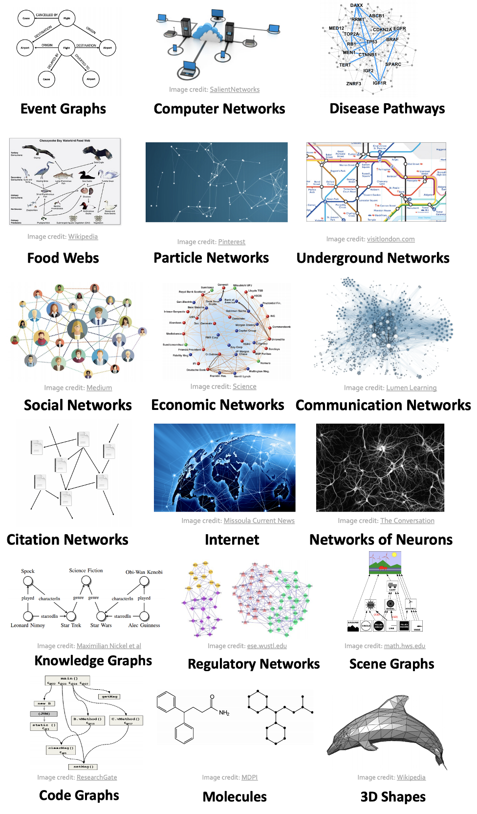
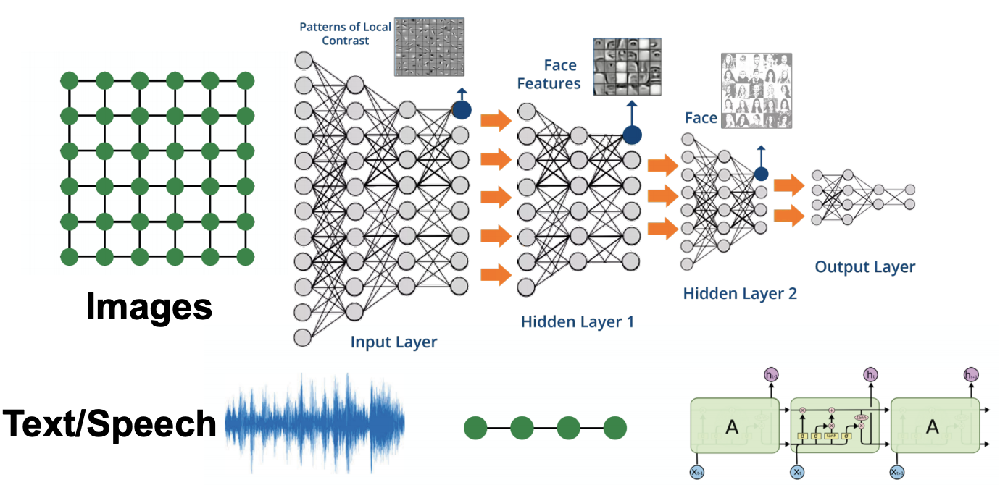
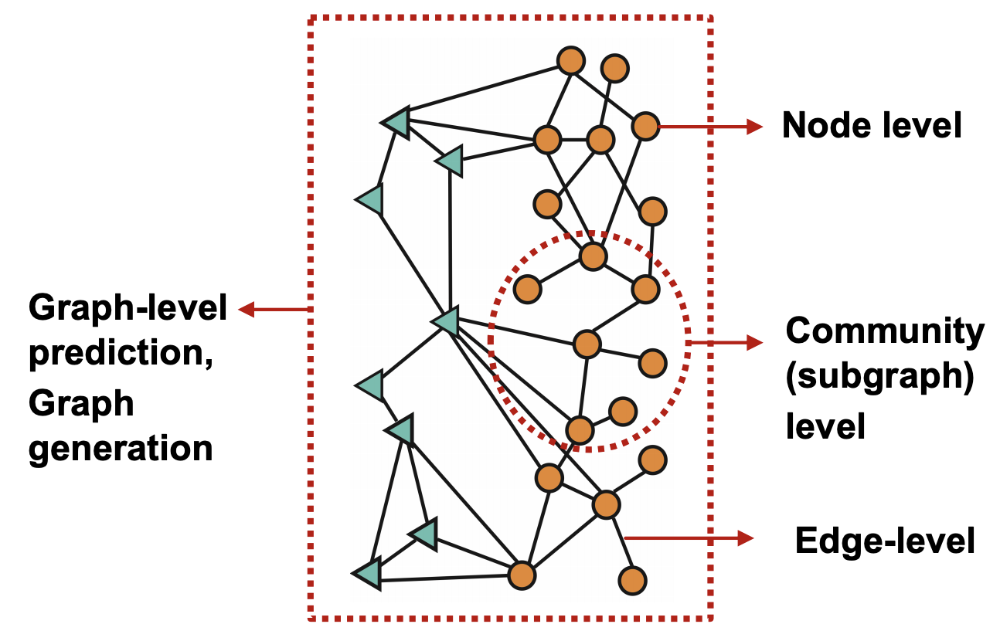
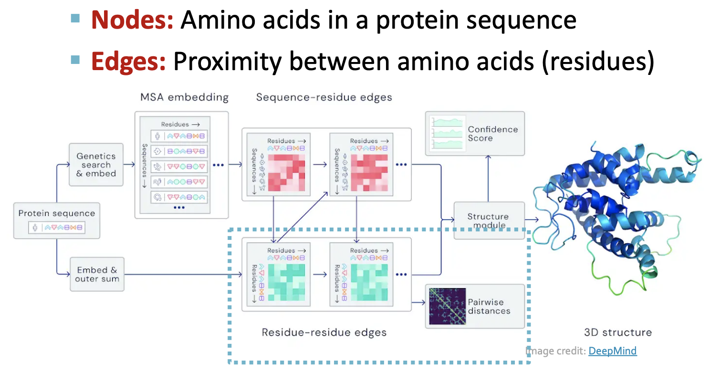
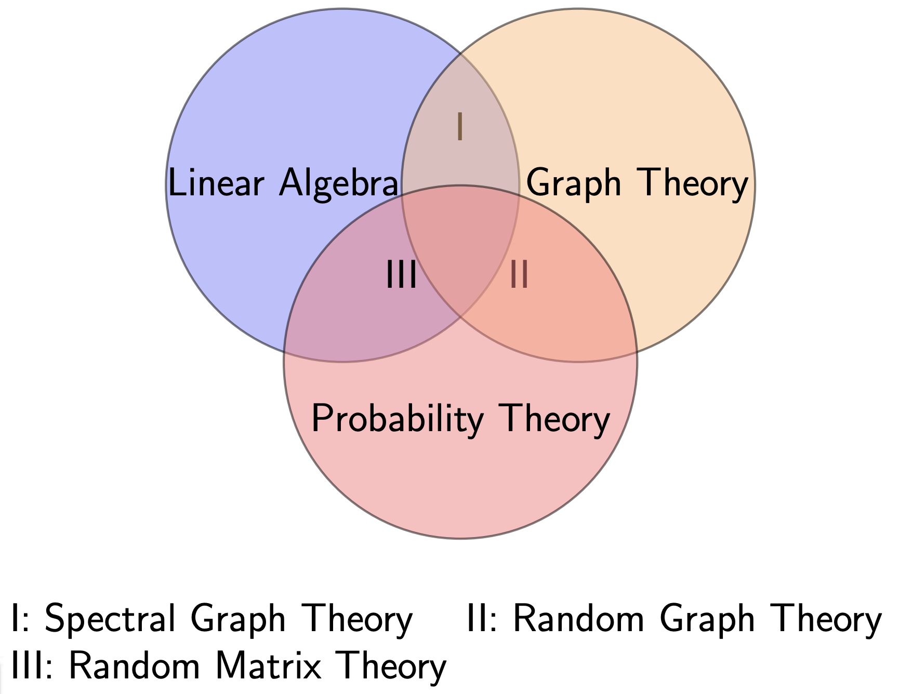

# For Graph-structured Data

Graphs are a general language for describing and analyzing entities with relations/interactions. Examples include social networks, biological networks, power grid, scene graphs, knowledge graphs, and similarity graph induced from a data matrix.


```{margin} Networks vs Graphs

Network often refers to real systems, with nodes and links. Graph is a mathematical representation of a network, with vertices and edges. Different networks can have the same graph representation.

```


:::{figure} mlg-real-graphs


Real-life graphs and networks
:::

## Why studying graphs?

- Necessity

  To model complex systems, we need to under stand how the underlying networks behind them.

- Advantage

  Complex domains (knowledge, text, images, etc) have a rich relational structure, which can be represented as a relational graph. By explicitly modeling relationships we achieve better performance!

- New approaches

  Modern ML models is designed for simple sequences & grids. We need new ML models to that take graphs as input, which
  - have arbitrary size and complex topological structure (i.e., no spatial locality like grids
  - no fixed node ordering or reference point
  - often dynamic and have multimodal features

  :::{figure} mlg-modern-ml
  

  Modern ML models is designed for simple sequences & grids
  :::

## Tasks

Tasks can lie in different level of a graph.

:::{figure} mlg-task-taxonomy


Tasks taxonomy in ML for graphs
:::


- Node classification
  - Predict the label of a node
  - Example: Categorize online users / items

- Node embeddings
  - Similar nodes on a graph are close in the embedding space
  - Methods: DeepWalk, Node2Vec

- Link prediction
  - Static graphs: predict whether there are missing links between two nodes
  - Dynamic graphs: Given fixed $N_v$, predict new edges in the next stage
  - Example: Knowledge graph completion, recommender systems, adverse side effect of drugs (impossible for real experiment)

- Clustering
  - Detect if similar nodes form a community with densely link
  - Example: Social circle detection

- Graph classification
  - Categorize different graphs
  - Example: Molecule property prediction

- Other tasks
  - Graph generation: Drug discovery, nodes are atoms and edges are chemical bonds
  - Graph evolution: Physical simulation
  - Graph similarity: compare molecules
  - Congestion in road networks
  - Identify
    - Polarization [[Political Polarization on Twitter]](https://www.aaai.org/ocs/index.php/ICWSM/ICWSM11/paper/viewFile/2847/3275)
    - Misinformation [[Disinformation on the Web]](https://cs.stanford.edu/people/jure/pubs/hoax-www16.pdf)
  - Model process of
    - Information cascade
    - Product Adoption [[Cascading invitations]](https://cs.stanford.edu/people/jure/pubs/linkedin-www15.pdf)

:::{figure} mlg-alphafold


Illustration of AlphaFold
:::


## Toolkit and Codebase:

- [PyTorch Geometric (PyG)](https://github.com/rusty1s/pytorch_geometric)
- [DeepSNAP](https://github.com/snap-stanford/deepsnap): Library that assists deep learning on graphs.
  - Flexible graph manipulation, standard data split pipeline, ...
- [GraphGym](https://github.com/snap-stanford/GraphGym): Platform for designing Graph Neural Networks.
  - Modularized GNN implementation, simple hyperparameter tuning, flexible user customization
- `SNAP.py`, `NetworkX`

## Reference

- ML + Graphs
  - Stanford CS244W: Machine Learning with Graphs [[link](http://web.stanford.edu/class/cs224w/slides/01-intro.pdf)]
- Theory
  - Lingyuan Lu: Selected topics in spectral graph theory [[link](https://people.math.sc.edu/lu/talks/nankai_2014/)]
  - John D. Cook: Ten spectral graph theory posts [link](https://www.johndcook.com/blog/2016/06/05/ten-spectral-graph-theory-posts/)
- More application using graphs and networks
  - National Research University Higher School of Economics: Structural Analysis and Visualization of Networks, Winter-Spring 2015 [[link](http://www.leonidzhukov.net/hse/2015/networks/)]

:::{figure} graph-theory-venn


Venn diagram of graph-related theories: I = spectral graph theory, II = random graph theory, III = random matrix theory. [Lingyuan 2014]
:::
