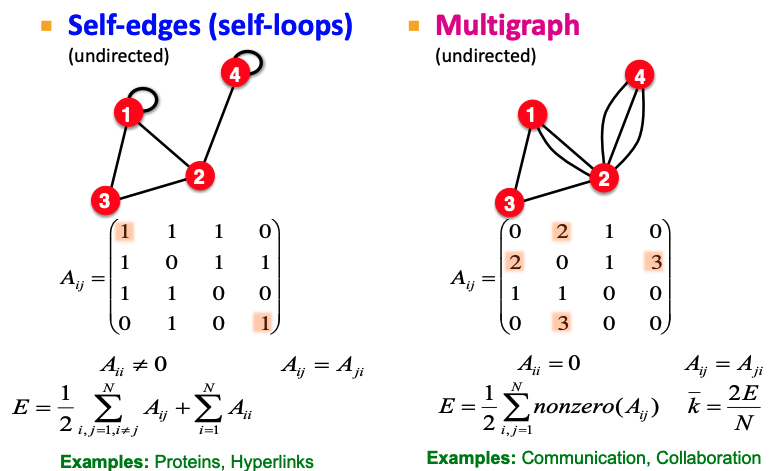
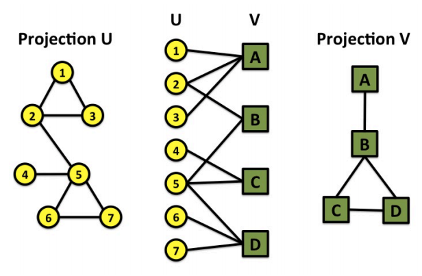
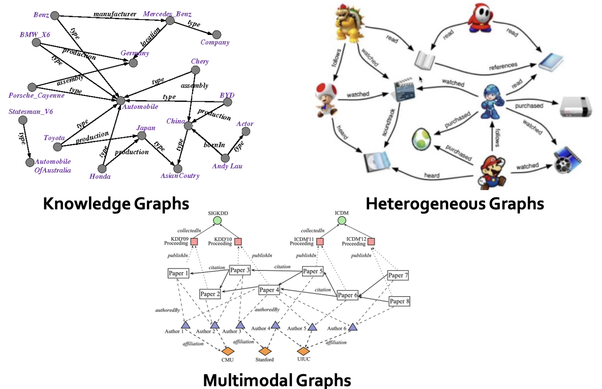
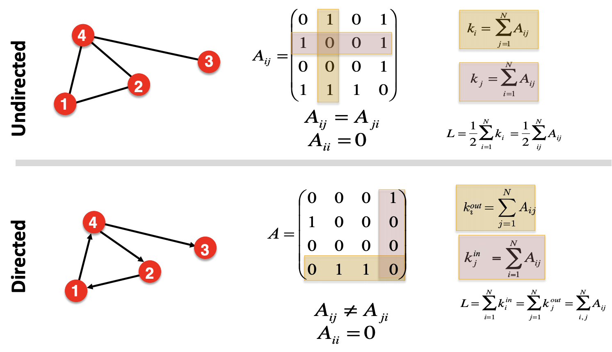
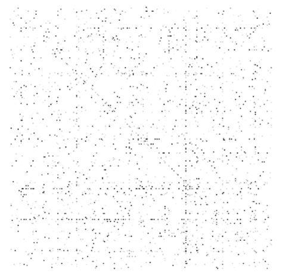
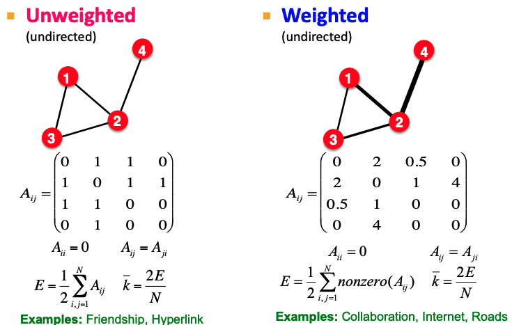

# Graphs

A graph $G = (V, E)$ contains vertex set $V$ and edge set $E$, with size $\left\vert V \right\vert = n$ and order $ \left\vert E \right\vert = m$.

In particular, $E$ is a 2-subset of $V$.

## Basic Terms

- If there is and edge $(u, v)$ connecting vertices $u$ and $v$, we say $u$ are $v$ are ends of edge $e$, or $u$ and $v$ are **adjacent**, or neighbors.

- If two edges $e_1 = (u, v)$ and $e_2 = (u, w)$ shares a common vertex $u$, we say $e_1$ and $e_2$ are **adjacent**.

- **Neighborhood** of a vertex: The (open) neighborhood of a vertex $v$ in graph $G$ is $N_G(v)= \left\{ u \mid (u, v) \in E(G) \right\}$. The closed neighborhood is $N_G [v] = N_G(v) \cup \left\{ v \right\}$.

- **Degree** of a vertex: The degree of a vertex $v$ is the number of its neighbors. $\operatorname{deg}_G (v) = \left\vert N_G(v) \right\vert$. In short we write $d(v)$.
  - Minimum degree is denoted as $\delta(G)=\min _v \operatorname{deg}_G(v)$
  - Maximum degree is denoted as $\Delta(G)=\max _v \operatorname{deg}_G(v)$
  - Sum of degree is $2m$: $\sum _{v \in V} \operatorname{deg}_G(v) = 2 \left\vert E \right\vert$
  - Corollary: In any graph, there are an even number of odd-degree vertices.

  Theorem
  : If in a graph $G$, all vertices have degree at least 2, then $G$ contains a cycle.

  :::{admonition,dropdown,seealso} *Proof*

  Let $P=(v_0, \ldots, v_{k})$ be a longest path in $G$. Since $d(v_k) \ge 2$, then there is a vertex $v \in V, v \ne v_{k-1}$, such that $v$ is adjacent to $v_k$. If $v \notin P$, then we have a longer path in $G$, contradiction. Hence, $v \in P$. More precisely, $v = v_i$ for some $0\le i \le k-2$. Thus, $v_k$ is connected to two vertices in $P$, which forms a cycle.
  :::

- **Path**: A path $P_n$ is a graph whose vertices can be arranged in a sequence $(v_1, \ldots, v_n)$ such that the edge set is $E = \left\{ (v_i, v_{i+1}) \mid i=1, \ldots, n-1 \right\}$.

- **Cycle**: A cycle $C_n$ is a graph whose vertices can be arranged a cycle sequence $(v_1, v_2, \ldots, v_n)$ such that the edge set is $E = \left\{ (v_i, v_{i+1}) \mid i=1, \ldots, n-1 \right\} \cup \left\{ (v_n, v_1) \right\}$.

- **Walk**: A walk in a graph $G$ is a sequence $W=(v_0, e_1, v_1, e_2, \ldots, v_{k-1}, e_k, v_k)$ whose terms alternate between vertices and edges (not necessarily distinct) such that $v_{i-1} v_i = e_i$ for $1 \le i \le \ell$. When $G$ is simple, we may write the walk by indicating the vertices only.

  - A walk is closed if the start and end vertices are the same $v_0 = v_k$.
  - A path is a walk such that all of the vertices and edges are distinct. If there is a walk from $u$ to $v$, then there is a path from $u$ to $v$ by removing all cycles in the walk.
  - The length of a walk is the number of edges of the walk. If is a walk from $x$ to $y$ of length $k$, we write $x \overset{k}{\rightarrow} y$. If $k$ is unknown, we write $x \overset{\star}{\rightarrow} y$.

- **Tail**: A trail is a walk such that all of the edges are distinct.
  - An Euler trail visits every edge once. A graph has a Euler trail if and only if the number of odd-degree nodes are 0 or 2. Moreover, if 0, then and node can be the start node, as well as the end node. If 2, then the two nodes are start and end nodes.
  - An Euler tour is an Euler trail that is closed. If a graph has an Euler tour, we call it Eulerian. A graph $G$ is Eulerian if and only if every vertex of $G$ has even degree.

- **Distance** between two vertices: The distance between two vertices $u$ and $v$ in $G$ is the minimal length of a walk from $u$ to $v$. $d_G (u,v) = \min \left\{ k \mid u \overset{k}{\rightarrow} v \right\}$. If there is no walk, then the distance is $\infty$.

## More Types of Graphs

- **Self-edges** (self-loops): allow self-edge $(u,u)$

- **Multi-graph**: allow multiple edges between two vertices.

  :::{figure} graph-self-edge-multigraph
  

  Self-edges graph and multigraph
  :::

- **Simple graph**: no self-edges, and no multiple edges.

- **Connected graph**: There is a path between every pairs of vertices.

  - **Bridge** edge: an edge $e \in E(G)$ is a bridge of $G$ if $G \setminus e$ has more connected components than $G$. In particular, if $G$ is connected, then $G \setminus$ is disconnected.
    - An edge $e \in E(G)$ is a bridge if and only $e$ is not in any cycle of $G$.
  - **Articulation** node: if we erase the node, the graph becomes disconnected.

  - The maximal connected subgraphs of $G$ are its **connected components**. We use $c(G)$ to denote the number of connected components in $G$. If $c(G)=1$ then $G$ is connected. "Maximal" here means if we add any one of other vertex to the connected subgraph, it becomes disconnected.

  To identify connectivity, we can check the adjacency matrix. The adjacency matrix of a graph with several components can be written in a block-diagonal form, so that nonzero elements are confined to squares, with all other elements being zero.

- **Connected directed graph**:

  - **Strong connected**: has a path from each node to every other node and vice versa ($a-b$ and $b-a$).

  - **Weakly connected**: connected if we disregard the edge directions.

  - **Strongly connected components**: a component that is strongly connected.
    - **in-component**: nodes that can reach SCC
    - **out-component**: nodes that can be reached from SCC

- **Completed graph**: every pair of vertices are adjacent, denoted as $K_n$.

- **Empty graph**: no edges, $E = \emptyset$.
  - An empty graph $\Leftrightarrow$ a $0$-regular graph.

- **Bipartite graph**: A graph whose vertex set can be partitioned into 2 sets $U$ and $V$ such that every edge $(u, v) \in E$ has $u \in U$ and $v \in V$. We usually write $G=(U,V,E)$.

  - A path is bipartite.
  - A cycle is bipartite iff its has even length.
  - Characterization: A graph $G$ is bipartite iff it contains no odd cycle.

  - Property: $\sum_{v \in V} \operatorname{deg}(v) = \sum_{u \in U} \operatorname{deg} (u) = \left\vert E \right\vert$

  - **Complete bipartite graph**: $E$ has every possible edge between the two sets $U$ and $V$, denoted $K_{n, m}$ where $n=\left\vert U \right\vert, m=\left\vert V \right\vert$.

    - **Star**: One vertex connecting two all other vertices. $K_{1,m}$.

  - **Folded/projected bipartite graphs**

    In the projection of a bipartite graph $G=(X,Y,E)$ over $X$, $x_1, x_2 \in X$ is connected if they are both connected to $y \in Y$.

    For instance, in the authors-papers network, we can find co-authorship network from projection on authors.

    :::{figure} graph-folded
    

    Folded/projected bipartite graphs
    :::

- **$r$-regular graph**: A graph $G$ is $r$-regular if $\operatorname{deg}_G (v)=r$ for all $v \in V(G)$.
  - A graph is $1$-regular $\Leftrightarrow$ it is a disjoint union of $K_2$.
  - A graph is $2$-regular $\Leftrightarrow$ it is a disjoint union of cycles of any lengths.
  - $3$-regular graph is called cubic. It must have even number of vertices.
  - A completed graph is $(n-1)$-regular.

- **Tree**
  - A graph with no cycles is acyclic.
  - Definition: A tree is a connected acyclic graph.
  - Characterization: A graph $G$ is a tree if and only any two of the three conditions hold: connected, acyclic, and $m = n - 1$.
  - A forest is an acyclic graph.
  - A vertex in a tree is a leaf if it has only one neighbor.
  - Every tree $T$ with $\left\vert V(T) \right\vert \ge$ 2 has at least 2 leaves (two ends of a maximal path).
  - A connected graph is a tree iff all of its edges are bridges.
  - Cayley's Formula: There are $n^{n-2}$ trees on a vertex set $V$ of $n$ elements. Related concept: Prufer Sequence.
  - Types of trees: star, double star, caterpillar (removing leaves gives the spine)

- **Hamiltonian Graphs**
  - Hamilton path: a path that covers every vertex once
  - Hamilton cycle: a cycle that covers every vertex once. A Hamilton cycle can be converted to a Hamilton path by removing one edge.
  - A graph $G$ is Hamiltonian if it has a Hamilton cycle.
      - If $G$ is Hamiltonian, then any supergraph $G ^\prime \supseteq G$ where $G ^\prime$ is obtained by adding new edges between non-adjacent vertices of $G$, then $G ^\prime$ is also Hamilton.
      - A cycle is Hamiltonian.
      - A complete graph $K_n$ is Hamiltonian.
      - A complete bipartite graph $K_{m,n}$ is Hamiltonian if and only if $n = m \ge 2$
      - No nice characterization of Hamiltonian graphs.

- **Heterogeneous graphs** (node are different kinds of objects)

- **Multimodal graphs** (topics, papers, authors, institutions)

  :::{figure} mlg-more-types
  

  More types of graphs
  :::

### Structure

- **Subgraph**: A graph $F$ is a subgraph of a graph $G$ if $V(F)\subseteq V(G)$ and $E(F)\subseteq E(G)$, also denoted as $F \subseteq G$.
- **Spanning subgraph**: A spanning subgraph $F$ is a subgraph obtained only by edge deletions. In other words, $V(F) = V(G)$ and $E(F)\subset E(G)$.
  - **Spanning tree**: spanning subgraph of $G$ that is a tree. Every connected graph $G$ has a spanning tree. Corollary: every connected graph has $m \ge n-1$.
- **Induced subgraph**: A induced graph $F$ is a subgraph obtained only by vertices deletion. If the remaining vertices are $Y=V(G)\setminus$, we denote $F$ by $G[Y]$.

### More Concepts

- Degree sequences, Havel-Hakimi theorem.

## Data Structure to Represent a Graph

The most intuitional representation is by an $n\times n$ **adjacency matrix**. It contains binary entries, which is $1$ if there is an edge between vertices $i$ and $j$, and zero otherwise.

:::{figure} graph-adjacency-matrix

Adjacency matrix for undirected and directed graph.
:::

Most real-world networks are sparse, $\left\vert E \right\vert\ll \left\vert E _\max \right\vert$, or $\bar{d} \ll n-1$, so the adjacency matrix is quite sparse.

:::{figure} graph-adjacency-sparse

Sparse adjacency matrix
:::

Adjacency matrix can also store weights.

:::{figure} graph-weights

Adjacency matrix with weights
:::

Other data structures include

- **Edge List**

  $m$ objects in the list, each object represents an edge, and stores the pair of vertices of that edge.

- **Adjacency List**

  $n$ objects in the list, each object represents a vertex, and stores a list of neighbors of that vertex.

  - Easy to work with large and sparse graphs.
  - Allows us to quickly retrieve all neighbors of a given vertex

  :::{figure} graph-edge-adjacency-list
  

  Edge list and adjacency list
  :::

- **Incidence matrix**

  Each row is a vertex, and each column is an edge.

  $$
  M_{ij} = \left\{\begin{array}{ll}
  1, & \text { if vertex $i$ belongs to edge $j$} \\
  0, & \text { otherwise }
  \end{array}\right.
  $$

  $\texttt{RowSum}(v)= \operatorname{deg} (v)$ and $\texttt{ColSum} = 2$.

  If there exists self-loop $j$ of vertex $i$, then $M_{ij}=2$.

## More Definitions

- **Isomorphic**: Two simple graphs $G$ and $H$ are isomorphic, denoted $G \cong H$ if there is a bijection $\theta: V(G) \rightarrow V(H)$ which preserves adjacency and non-adjacency:

  $$
  (u,v) \in E(G) \Leftrightarrow (\theta(u), \theta(v)) \in E(H)
  $$

  To determine isomorphism of two graphs, we can start by comparing some properties, such as $n$, $m$, $r$-regular, number of non-adjacent vertices etc.

## Decomposition

A **decomposition** of a graph $G$ is a family $\mathcal{F}$ of edge-disjoint subgraphs of $G$ such that all edges in $G$ are in some subgraphs.

$$\cup _{F \in \mathcal{F}} E(F) = E(G)$$

If every subgraph of $\mathcal{F}$ is a cycle, then the decomposition is called a cycle decomposition. Similarly, if every subgraph of $\mathcal{F}$ is a path, then the decomposition is called a path decomposition. A trivial path decomposition exists there each subgraph is an edge. But some graphs have no cycle decompositio n.

A graph $G$ has a cycle decomposition if and only if every vertex in $G$ has even degree.

## Exercise

1. Prove or disapprove: For three vertices $u, v, w \in V(G)$, if there is an even-length path from $u$ to $v$ and an even-length path from $v$ to $w$, then there is an even-length path from $u$ to $w$.

    :::{admonition,dropdown,seealso} *Solution*

    False.

    $$\begin{aligned}
    &\ v \\
    &/ \ \backslash \\
    u-w&-\circ \\
    \end{aligned}$$

    :::

1. Every vertex in $G$ has even degree, if only if
   - $G$ has a cycle decomposition
   - $G$ has an Euler tour.

1. Theorems
    - If in a graph $G$, all vertices have degree at least 2, then $G$ contains a cycle.
    - A graph $G$ is bipartite $\Leftrightarrow$ it contains no odd cycle.
    - An edge $e \in E(G)$ is a bridge $\Leftrightarrow$ $e$ is not in any cycle of $G$ (proof by contrapositive).
    - A graph $G$ is a tree $\Leftrightarrow$ $G$ is acyclic and $\left\vert E(G) \right\vert = \left\vert V(G) \right\vert -1$.
    - A connected graph is a tree iff all of its edges are bridges

1. A $k$-coloring of graph $G$ partitions the vertex set $V$ into $k$ independent sets $V_1, \ldots, V_k$.

.

.

.

.

.

.

.
