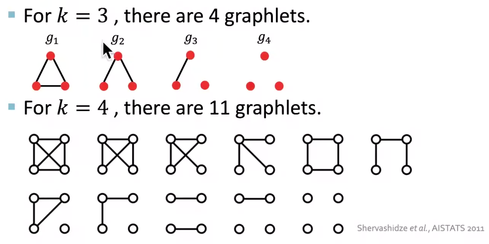

# Descriptive Analysis

How to measure the importance of a vertex or an edge? Degree, centrality.

How to measure the cohesiveness of a graph? Density, connectivity, partitioning, assortativity.

## Degree

### Degree Distributions

Given a network graph $G$, define $f(d)$ to be the fraction of vertices $v \in V$ with degree $d_v = d$. The collection $\left\{ f(d) \right\}$ is called the degree distribution of $G$, which is simply the histogram formed from the degree sequence, with bins of size one.

For directed graphs, degree distributions may be defined analogously for in- and out-degrees.

:::{figure} graph-deg-dist

Degree distributions in base-2 logarithmic scale [Kolaczyk 2009]
:::

In each plot, we can see that majority of vertices are of very low degree, a nevertheless non-trivial number of vertices are of much higher degree. The distribution is right skewed. There is roughly a linear decay, which suggests the presence of a power-law component to these distributions:

$$
f(d) \propto d^{-\alpha}
$$

There are several methods to estimate $\alpha$, or in general, fitting power-law-like distributions. For details see Mitzenmacher [SAND 280].

- Linear regression

  The above relation implies

  $$\log f(d) \sim C-\alpha \log d$$

  Hence we can fit a line to the above plots, and $\hat{\alpha} = - \hat{\beta}$ where $\hat{\beta}$ is the estimated slope.

  However, this method is not advisable due to the disproportionate level of 'noise' in the data at the high degrees.

- Linear regression using cumulative frequencies

  To smooth the noise, we use cumulative frequencies rather than raw frequencies. Note that

  $$\bar{F}(d)=1-F(d) \sim d^{-(\alpha-1)}$$

  We can then fit a line to the plot of $\log \bar{F}(d)$ over $d$.

- Use relative frequencies calculated on intervals of log increasing size (i.e. logarithmic binning).

- Hill estimator of $\gamma = (\alpha - 1) ^{-1}$

  $$
  \hat{\alpha}_{k}=1+\hat{\gamma}_{k}^{-1}, \quad \text { with } \quad \hat{\gamma}_{k}=\frac{1}{k} \sum_{i=0}^{k-1} \log \frac{d_{\left(N_{v}-i\right)}}{d_{\left(N_{v}-k\right)}}
  $$

  where $d_{(1)} \leq \cdots \leq d_{\left(N_{v}\right)}$ are the sorted vertex degrees and $k$ is a value chosen by users. Typically, one can plot $\hat{\alpha}_k$ for a range of $k$, and look for an area where the plot settle down to some stable values of $\hat{\alpha}$. If the decay is sharp and there is no flatten area, then it suggests that a simple power-law-like model is inappropriate.

  :::{figure} graph-deg-hill-plot
  

  Hill plots of $\hat{\alpha}_k$ over $k$ for the two datasets above. Note different decay shapes. [Kolaczyk 2009]
  :::

- mixtures of power-laws

- power-law + exponential truncation

  $$f(d) \propto d^{-\alpha} \exp \left(-d / d^{*}\right)$$

### Joint Degree Distribution

Two graphs may have identical degree sequences and yet otherwise differ noticeably in the way their vertices are paired. To capture information of this sort, we consider a two-dimensional analogue of the degree distribution, i.e. joint degree distribution $f(d_1, d_2)$, which is symmetric.

- For a directed graph, it equals the frequency of an arc $(u, v)$ such that $d_u = d_1, d_v = d_2$.
- For an undirected graph,
  - if $d_1 < d_2$ then $f(d_1, d_2) = f(d_2, d_1) = \frac{1}{2} \times$ frequency of edge such that one end has degree $d_1$ and the other has $d_2$.
  - if $d_1 = d_2 =d$ then $f(d, d) =$ frequency of edge $(u, v)$ such that $d_u = d_v = d$.

In the plot below, we see that the joint distribution concentrate primarily where pairs $(d_1, d_2)$ are both low. However, we can see there is also noticeable tendency for the vertices of largest degree to be connected to low-degree vertices.

:::{figure} graph-deg-dist-joint

Joint degree distributions for the two datasets. Colors range from blue (low relative frequency) to red (high relative frequency), with white indicating areas with no data. [Kolaczyk 2009]
:::

### Conditional Degree Distribution

From the joint degree distribution we can define conditional degree distribution $f_{d ^\prime \vert d}$: given a vertex of degree $d$, what is the relative frequency of its neighbor that has degree $d ^\prime$?

$$f_{d ^\prime \vert d} = \mathbb{P}\left( D_v = d ^\prime \vert D_u = d, (u,v) \in E \right)$$

We can also defined the conditional mean

$$\bar{d}(d)=\sum_{d^{\prime}} d^{\prime} f_{d^{\prime} \mid d}$$

A negative trend has been observed in $\bar{d}(d)$ as $d$ increases.

(degree-correlation)=
### Degree Correlation

Analogously, we can define correlation $\operatorname{Corr}\left( D, D ^\prime  \right)$ by the joint degree distribution $f(d_1, d_2)$ and its marginals.

For the two data sets above, the degree correlation is 0.023 and -0.093 respectively. Though they are small, the difference in sign reinforces our observation of high-low degree pair in the second data set.

A closely related concept is [assortativity](graph-assortativity).

## Centrality

The importance of a vertex $v$ can be measured by centrality $c(v)$. There are many kinds of centrality measures. Degree is one of them. Deciding which are most appropriate for a given application clearly requires consideration of the context.

Other measures like local clustering coefficient and graphlet degree vector can also be used to measure importance of node, which are introduced in the next section.

### Closeness Centrality

Closeness centrality measures how close a vertex is to other vertices.

$$c_{cl}(v) = \frac{1}{\sum_{u \in V} \operatorname{dist}(v, u) }$$

where $\operatorname{dist} (v, u)$ is the distance between $u, v$.

Note
- The graph is assumed to be connected. If not, we can define centrality for each connected component, or set a finite upper limit on distances, e.g $N_v$.
- To compute $c_{cl}(v)$, we need to compute single-source shortest paths from $v$ to all other vertices $u \in V$.
- Often, for comparison across graphs and with other centrality measures, this measure is normalized to lie in the interval $[0,1]$, through multiplication by a factor $N_v - 1$. It is 1 if $v$ is the center of a star.

### Betweenness Centrality

Betweenness centrality relates 'importance' to where a vertex is located with respect to the paths in the graph.

$$
c_{bet}(v) = \sum_{s,t \in V, s\ne v, t \ne v}\frac{\sigma(s,t \mid v)}{\sigma(s,t)}
$$

where
- $\sigma(s,t \mid v)$ is the total number of shortest paths between $s$ and $t$ that pass through $v$
- $\sigma(s,t)$ is the total number of shortest paths between $s$ and $t$

Note

- If all shortest paths are unique, i.e. $\sigma(s,t)=1$, then $c_{bet}(v)$ simple counts how many shortest paths going through $v$.
- It can be normalized to $[0,1]$ through division by $(N_v - 1) (N_v - 2)/2$. For instance, it is 1 if $v$ is the center of a star.

(eig-centrality)=
### Eigenvector Centrality

A vertex's importance may depends on its neighbors' importance. Eigenvector centrality captures this,

$$
c_{eig}(v) = \alpha \sum_{(u,v) \in E} c_{eig}(u)
$$

The vector $\boldsymbol{c} _{eig} = [c_{eig}(1), \ldots, c_{eig}(N_v)] ^{\top}$ is the solution to the eigenvalue problem

$$
\boldsymbol{A} \boldsymbol{c} _{eig} = \alpha ^{-1} \boldsymbol{c} _{eig}
$$

Bonacich [SAND 37] argues that an optimal choice of $\alpha ^{-1}$ is the largest eigenvalue of $\boldsymbol{A}$, and hence $\boldsymbol{c} _{eig}$ is the corresponding eigenvector.

When $G$ is undirected an connected, the largest eigenvector of $\boldsymbol{A}$ is simple: entries are non-zero and share the same sign. Convention is to report the absolute values of these entries.

:::{admonition,note} Computation

Calculation of the largest eigenvalue of a matrix and its eigenvector is a standard problem. The power method is generally used. This method is iterative and is guaranteed to converge under various conditions, such as when the matrix is symmetric, which $\boldsymbol{A}$ will be for undirected graphs. The rate of convergence to $\boldsymbol{c} _{eig}$ will behave like a power, in the number of iterations, of the ratio of the second largest eigenvalue of $\boldsymbol{A}$ to the first.

:::

### Hubs and Authorities (HITS) Algorithms

Given an adjacency matrix $\boldsymbol{A}$ for a directed web graph,
- hubs are determined by the eigenvector centrality of the matrix $\boldsymbol{M}_{hub} = \boldsymbol{A} \boldsymbol{A} ^{\top}$, where $[\boldsymbol{M}_{hub}]_{ij}=$ the number of vertices that both $i$ and $j$ point to.

  $$[\boldsymbol{M}_{hub}]_{ij}= \langle\boldsymbol{a}_{i\cdot}, \boldsymbol{a} _{j \cdot} \rangle = \sum_{v \in V} \mathbb{I} \left\{ i \rightarrow v \leftarrow j \right\}$$

- authorities are determined by the eigenvector centrality of the matrix $\boldsymbol{M}_{auth} = \boldsymbol{A} ^{\top}\boldsymbol{A}$, where $[\boldsymbol{M}_{auth}]_{ij} =$ the number of vertices that point to both $i$ and $j$.

  $$[\boldsymbol{M}_{hub}]_{ij}= \langle\boldsymbol{a}_{\cdot i}, \boldsymbol{a} _{\cdot j} \rangle = \sum_{v \in V} \mathbb{I} \left\{ i \leftarrow v \rightarrow j \right\}$$

### Centrality of Edges

Betweenness centrality extends to edges in a straightforward manner. For other measures, we can apply them to the vertices in the edge-to-vertex dual graph (line graph) of $G$.

### Graph-level Summaries

Once we compute $c(v)$ for all $v$, we can look for graph-level summaries, e.g. the distribution of $c(v)$, in analogy to the degree distribution, as well as its moments and quantiles.

For instance, centralization index is defined as

$$
c = \frac{\sum_{v \in V} c^* - c(v)}{\max \sum_{v \in V} c^* - c(v)}
$$

where
- $c^* = \max_{v \in V} c(v)$
- $\max$ in the denominator is over all possible graphs of order $N_v$, which is not easy to compute outside of certain special cases.

There are many other extension of the above centrality measures to different levels.

## Cohesion

Are some subsets of vertices cohesive? Many measures differ from local (triads) to global (giant components), and explicitly (cliques) or implicitly (clusters).

### Local Density

### Cliques

Recall that a clique is a complete subgraph $H$ of $G$. A common case is that of 3-cliques, i.e. triangles. In practice, large cliques are rare. A sufficient condition for a clique of size $n$ to exist in $G$ is $N_e > \frac{n-2}{n-1}\frac{N_v^2}{2}$. But in real-world networks, $N_e \sim N_v$.

- P:
  - whether a specific subset of nodes $U\subseteq V$ is a clique and whether it is maximal. $O(N_v + N_e)$.
- NP-complete:
  - whether a graph $G$ has a maximal clique of ata least size $n$

### Plexes

Plexes are weakened version of cliques: A subgraph $H$ consisting of $m$ vertices is called an $n$-plex for $m > n$ if no vertex has degree less than $m-n$. In other words, no vertex is missing more than $n$ of its possible $m-1$ edges with other vertices in the subgraph.

Computation problems tend to scale like those involving cliques.

### Cores

A $k$-core of a graph $G$ is a subgraph $H$ for which all vertices have degree at least $k$.

A maximal $k$-core subgraph may be computed in $O(N_v +N_e)$. The algorithm computes the shell indices for all $v$. The shell index of $v$ is the largest value $c$ such that $v$ belongs to the $c$-core of $G$ but not its $(C+1)$-core.

### Density

The density of a subgraph $H = (V_H, E_H)$ is defined as the realized fraction of total possible edges in this subgraph

$$
\operatorname{den}(H)=\frac{\left|E_{H}\right|}{\left|V_{H}\right|\left(\left|V_{H}\right|-1\right) / 2} \in [0,1]
$$

It measures how $H$ is close to a clique. If $\operatorname{den}(H) =1$ then $H$ is a clique. Note that it is a rescaling of the average degree, $\operatorname{den}(H) = \frac{1}{\left\vert V_H \right\vert-1} \bar{d}(H)$

- If $H=G$, then $\operatorname{den}(G)$ gives the density of the overall graph
- If $H=N(v)$ is the set of neighbors of a vertex $v$ and the edges between them, then $\operatorname{den}(N(v))$ gives a measure of density in the immediate neighborhood of $v$, which is called the Watts-Strogatz local clustering coefficient. The average of $\operatorname{den}(N(v))$ can be used as a clustering coefficient for the overall graph.

### Clustering Coefficient

A measure of density in the immediate neighborhood of $v$ can be the answer to the question: among all pairs of neighbors of $v$, how many of them are connected? Or, what's the proportion that two of my friends are also friends of each other? To answer this, we first formally define triangles and connected triples.

- A triangle is a complete subgraph of order three: $\Delta$
- A connected triple is a subgraph of three vertices connected by two edges (i.e. 2-star): $\land$

Let
- $\tau_\Delta(v)$ be the number of triangles in $G$ such that $v \in V$ falls into
- $\tau_{\land}(v)$ be the number of connected triples in $G$ such that both edges incident to $v\in V$.

We can then define a local clustering coefficient as to answer the questions above. For $v$ with at least two neighbors, i.e. $\tau_{\land }(v) > 0$,

$$
\operatorname{clus} (v) = \frac{\tau_{\Delta}(v)}{\tau_{\land }(v)}
$$

Note that $\tau_{\land }(v) = C_{d_v}^2$ and hence $\operatorname{clus} (v) = \operatorname{den}(N(v))$.

The **clustering coefficient** for $G$ is the average over "eligible" vertices in $G$,

$$
\operatorname{clus} (G) = \frac{1}{\left\vert V ^\prime  \right\vert}  \sum_{v \in \boldsymbol{V} ^\prime } \operatorname{clus}(v)
$$

where $\boldsymbol{V} ^\prime \subseteq V$ is the set of vertices $v$ with $d_v \ge 2$.

### Transitivity

The above definition is an simple average of $\operatorname{clus}(v)$, which treat $v$ with different $d_v$ equally. A more informative measure is the weighted average by $\tau_{\land }(v)$,

$$
\frac{\sum_{v \in V ^\prime} \tau_{\land }(v) \operatorname{clus} (v) }{\sum_{v \in V ^\prime} \tau_{\land }(v)} = \frac{\sum_{v \in V ^\prime} \tau_{\Delta}(v)}{\sum_{v \in V ^\prime} \tau_{\land }(v)}
$$

Let
- $\tau_\Delta (G) = \frac{1}{3} \sum_{v \in V} \tau_\Delta(v)$ be the number of triangles in the graph
- $\tau_ \land (G) = \sum_{v \in V} \tau _ \land (v)$ be the number of connected triples in the graph

For $v \ne V ^\prime$, we have $\tau_\Delta(v) = \tau_ \land  (v) = 0$, hence the above fraction equals to

$$\operatorname{clus}_T (G) = \frac{3 \tau_\Delta(G)}{\tau_ \land (G)}$$

which is called the **transitivity** of graph $G$, a standard quantity in the social network literature. Transitivity in this context refers to, for example, the case where the friend of your friend is also a friend of yours.

The two clustering measures $\operatorname{clus}(G)$ and $\operatorname{clus}_T(G)$ can differ. It is possible to define highly imbalanced graphs so that $\operatorname{clus}(G) \rightarrow 1$ while $\operatorname{clus}_T(G) \rightarrow 0$ as $N_v$ grows.

Clustering coefficients have become a standard quantity used in the analysis of network structure. Interestingly,
- their values have typically been found to be quite large in real-world networks, in comparison to what otherwise might be expected based on classical random graph models.
- in large-scale networks with broad degree distributions, it has frequently been found that the local clustering coefficient $\operatorname{clus}(v)$ varies inversely with vertex degree.

Higher-order clustering coefficients have also been proposed, involving cycles of length greater than three.

### Graphlet Degree Vector

We can view  
- degree counts #(edges) that a node touches
- clustering coefficient counts #(triangles) that a node touches (divided by neighbor pairs)

GDV counts the number of graphlets that a node touches.

:::{figure} graph-gdv-ep

Example of GDV [Leskovec 2021]
:::

If we consider graphlets on 2 to 5 nodes, we get a vector of 73 coordinates, which can be used as a signature of a node that describes the topology of nodes's neighborhood structure. This captures the structure out to a distance of 4 hops, better than degree and clustering coefficient which only do 1 hop.

### Connectivity

The task of verifying whether a graph is connected and, if not, identifying its connected components can be done in $O(N_v + N_e)$ time by DFS or BFS. If it does not, we might seek to quantify how close to being able to do so it is.

### Small World

Often it is the case that one of the connected components in a graph G dominates the others in magnitude, in that it contains the vast majority of the vertices in $G$. We call it the **giant component**. Depending on the task at hand, it may be sensible to restrict attention to that component alone in carrying out further analysis and modeling.

The giant component of many real-world networks enjoys the small world property. This concept is traced back to Stanley Milgram's experiment in 1960's: people are only separated by roughly six acquaintances (i.e., by 'six degrees of separation'). That is, despite the enormous size of the giant component, the typical number of ‘hops’ along shortest paths between any two vertices would be quite small.

To measure 'small', we can define the **average distance** between two vertices

$$
\bar{l}=\frac{1}{N_{v}\left(N_{v}+1\right) / 2} \sum_{u \neq v \in V} \operatorname{dist}(u, v)
$$

We say it is small if $\bar{l}$ scales as $\mathcal{O} (\log N_v)$ or less. A necessary result is $\operatorname{diam}(G) = \mathcal{O} (\log N_v)$.

Besides, small average distance is often accompanied by a high clustering coefficient $\operatorname{clus}(G)$ or $\operatorname{clus} _T (G)$ (but not necessary). These two properties (or the first alone) joint define the term 'small world', which is related to communication upon them, e.g. information in a social network, disease in an epidemiological network, etc.

### Vertex and Edge Connectivity and Cut

If an arbitrary subset of k vertices (edges) is removed from a graph, is the remaining subgraph connected?

Definitions (connectivity)
: - A graph is **$k$-vertex-connected** if
    - $N_v > k$, and
    - the removal of **any** subset of vertices $X \subset V$ of cardinality $\left\vert X \right\vert < k$ leaves a subgraph $G-X$ that is connected.

    In particular, for graphs $G$ with at least two vertices, it is 1-vertex-connected iff it is connected.

  - Similarly, a graph is **$k$-edge-connected** if
    - $N_v > k$, and
    - the removal of **any** subset of edges $Y \subset E$ of cardinality $\left\vert Y \right\vert < k$ leaves a subgraph $G - Y$ that is connected.

  - The **vertex (edge) connectivity** of $G$ is the largest integer $k$ such that $G$ is $k$-vertex- ($k$-edge-) connected.

It can be shown that

$$
\text{vertex connectivity} \le  \text{edge connectivity} \le \operatorname{deg}_\min
$$

Computationally, the following problems are in P
- Is $G$ $k$-vertex ($k$-edge) connected?
- What is the vertex(edge)-connectivity of $G$
- What is the maximal $k$-vertex ($k$-edge) connected components of $G$?

Theorem (Menger's)
: a nontrivial graph $G$ is $k$-vertex ($k$-edge) connected if and only if all pairs of distinct vertices $u, v \in V$ can be connected by $k$ vertex-disjoint (edge-disjoint) paths.

Definitions (cut)
: - A **vertex-cut (edge-cut)** is a set such that removing it disconnects the graph.
  - A $s$-$t$ **cut** is a partition of $V$ into two disjoint, non-empty subsets, $S, \bar{S} \subset V$ where $s \in S$ and $t \in \bar{S}$.
  - For $G$ equipped with edge weights $w_e$, a $s$-$t$ cut is a **minimum** $s$-$t$ cut if the sum of the weights on edges connecting $S$ and $\bar{S}$ is a minimum.

Claims
- If $w_e =1$ for all $e$, then finding a minimum $s$-$t$ cut is equivalent to finding an edge-cut of minimal cardinality, with one component containing $s$ and the other containing $t$.
- If the cardinality of such minimum $s$-$t$ cut is $k$, then the edge-connectivity of $G$ is $k-1$.

To find a minimum $s$-$t$ cut, it is equivalent to find a maximum flow. See the [section](max-flow) for details.

### In Directed Graphs

Many of the concepts above extend to the case of directed graphs analogously. A often useful characterization of directed graphs is that of a **bowtie**. We can classify the graph into five parts

1. a strongly connected component (SCC)
1. an in-component, whose vertices that can reach SCC but cannot be reached from the SCC
1. an out-component, whose vertices that cannot reach SCC but can be reached from the SCC
1. tendrils, composed of vertices that can neither reach nor be reached from the SCC.
1. tubes, composed of vertices between the in- and out- components that are not part of the SCC

In the vastly large Word Wide Web graph, Broder and colleagues found that the relative size of the first four parts of the bowtie in their giant component were in fact roughly equal in size.

:::{figure} graph-bowtie

Bowtie illustration [Broder] and application to a network data set [Kolaczyk 2009]. Strongly connected component (yellow), in-component (blue), out-component (red), and tendrils (pink).
:::

### Graph Partitioning

A cohesive subset of vertices generally is taken to refer to a subset of vertices that are
- well connected among themselves, and
- relatively well separated from the remaining vertices.

It has been used in the detection of community structure in social networks and in the identification of possible protein complexes from protein interaction networks

Graph partitioning algorithms typically seek a partition $\mathcal{C} = \left\{ C_1, \ldots ,C_K \right\}$ of the vertex set $V$ of a graph $G = (V,E)$ in such a manner that the sets $E(C_k,C_{ k ^\prime })$ of edges connecting vertices in $C_k$ to vertices in $C_{k ^\prime }$ are relatively small in size compared to the sets $E(C_k)$ of edges within $C_k$.

Two main methods are hierarchical clustering and spectral clustering. For details, see the [clustering](clustering) section. More methods are under active research.

Other methods are variations or extensions of the two, including

- [SAND 174] Iterative removal of edges in a graph, by their 'importance', e.g. edge-betweenness centrality, since these edges likely serve as 'bridges' separating cohesive subsets of vertices. This method requires $\mathcal{O} (N_v ^3)$, but can be implemented in parallel in nearly linear time. Other edge importance measures can also be used, e.g. based on concepts of resistance and random walks.
- [SAND 172] Characterizing community structure in World Wide Web using the hubs-and-authorities notion.
- [SAND 401] Block modeling.
- Embed the graph into a Euclidean space, and apply a standard clustering algorithm, e.g. $k$-means clustering.

(graph-assortativity)=
### Assortativity and Mixing

Do vertices form a cohesive subset because they have some similar characteristics?

Selective linking among vertices, according to a certain characteristic(s), is termed **assortative mixing** in the social network literature, which can be measured by some assortativity coefficients.

The assortativity coefficients we describe here are attributed to Newman [SAND 293] and are essentially variations on the concept of correlation coefficients in statistics.

The characteristics can be categorical, ordinal, or continuous. We first consider the categorical case.

#### Categorical

Suppose there are $M$ categories. We can define $f_{ij} = \frac{\left\vert E(C_i, C_j) \right\vert}{\left\vert E(G) \right\vert}$ in the same way as that in modularity, where $C_i$ is the set of vertices in category $i$. The assortativity coefficient is then

$$
r_{a}=\frac{\sum_{i} f_{i i}-\sum_{i} f_{i+} f_{+i}}{1-\sum_{i} f_{i+} f_{+i}}
$$

The value is
- 0 when the mixing in the graph is no different from that obtained through a random assignment of edges that preserves the marginal degree distribution, where $\mathbb{E}\left( f_{ii} \right) = f_{i+} \cdot f_{+i}$
- 1 when the mixing is perfect assortative, i.e.$f_{ij}=0$ for $i\ne j$.
- minimum when the mixing is perfectly disassortative, i.e. $f_{ii}=0$ for all $i$

  $$
  r_{a}^{\min }=-\frac{\sum_{i} f_{i+} f_{+i}}{1-\sum_{i} f_{i+} f_{+i}}
  $$

Hence the $r_a \in [-1,1]$ but does not achieve $-1$ in the case of perfect disassortative mixing. Newman [SAND 293] argues that this behavior may be interpreted as reflecting that disassortative networks can range less ‘far’ from randomness than assortative networks.

#### Continuous

For ordinal or continuous characteristics, let $(x, y)$ be the value of the characteristic for the vertices joined by an edge $e \in E$. To quantify the assortativity, we can simply use the Pearson correlation coefficient of the pairs $(x_e, y_e)$

$$
r = \frac{\operatorname{Cov}\left( X, Y \right)}{\sqrt{\operatorname{Var}\left( X \right)\operatorname{Var}\left( Y \right)}} = \frac{\sum_{x,y} xy (f_{xy} - f_{x+}f_{+y})}{\sigma_x \sigma_y}
$$

where $\sum_{x,y}$ is over unique pairs $(x, y)$. In particular, when the characteristic is vertex degree, this quantity is simply the [degree correlation](degree-correlation).

### Application

For details see SAND 4.4.

- Time series to graph: suppose we have $N$ time series, we can compute pairwise correlation, and build a similarity graph $G_1$ of $N$ vertices. There is an edge between vertex $i$ and $j$ if their correlation is greater than some threshold.
- Descriptive analysis: suppose some underlying state change after some event, such that the pairwise correlations change. We can build a new similarity graph $G_2$ accordingly. Then, we can compute descriptive statistics introduced above for $G_1$ and $G_2$.
- Difference: we can even compute the difference of these quantities before and after the event. This gives information about how these times series are related to the event.
- Testing: we can also test the significance of the changes. Note the multiple testing issue.

## More

### Dynamic Graphs

Dynamic graphs refers to a collection $\left\{ G_{t} \right\}$ of graphs indexed over times $t$ in some set $T$.

Settings
- cumulative: a vertex or edge present in $t$ and stay after $t$
- snapshots: a vertex or edge present in a certain interval of time around $t$

Problems
- extension of theorems in static graphs to dynamic graphs, e.g. Menger's theorem [SAND 224]
- combinatorial problems that incorporates time [SAND 285]
- evolution of static descriptive statistics over time: degrees, diameter, clustering behavior etc.

### Graph Kernels

Recall that [kernel functions](kernels) can be used as a similarity measures. Can we apply kernel function over graphs, i.e. $k(G, G ^\prime) = \boldsymbol{\phi} (G) ^{\top} \boldsymbol{\phi}(G ^\prime) \in \mathbb{R}$, to measure similarity between two graphs? The answer is yes, and all we need is to construct a feature vector $\boldsymbol{\phi}(G)$ of a graph $G$.

A natural way to construct a graph-level feature vector is to use degree frequencies of that graph. It counts the number of nodes that have some degree. This is a kind of bag-of * idea. Graphlet kernel and Weisfeiler-Lehman kernel both use this idea but * can be sophisticated.

#### Graphlet Kernel

The * in graphlet kernel is graphlets. It counts the number of different graphlets in a graph. Note that the definition of graphlet here is different from that in node-level where we only consider rooted, connected, non-isomorphic subgraphs. Here we drop the fist two conditions. Let $\mathcal{G}_k = \left\{ g_1, g_2, \ldots g_{n_k} \right\}$ be a list of graphlets of size $k$, with cardinality $n_k$. For instance,

:::{figure} graph-kernel-graphlet

Non-isomorphic graphlets
:::

Given a graph $G$ and and a graphlet list $\mathcal{G}_k$, the graphlet frequency vector $\boldsymbol{f}_G \in \mathbb{R} ^{n_k}$ is defined as

$$
[\boldsymbol{f}_G]_i = \#(g_i \subseteq G)\quad \text{for } i=1, 2, \ldots, n_k
$$

Since $G$ and $G ^\prime$ may have different sizes, it's better to normalize $\boldsymbol{f}$ by $\boldsymbol{h}_G = \frac{\boldsymbol{f}_G }{ \sum_{i=1}^{n_k} [\boldsymbol{f}_G]_i }$, i.e. use density rather than frequency. Using $\boldsymbol{h}$ as $\boldsymbol{\phi}$, the graphlet kernel is then

$$
k(G, G ^\prime ) = \langle \boldsymbol{h}_G, \boldsymbol{h}_{G ^\prime} \rangle
$$

It is easy to see the counting step is expensive. In fact, subgraph isomorphism test (judging whether a graph is a subgraph of another graph) is NP-hard. If a graph's node degree is bounded by $d_{\max}$, then an $\mathcal{O} (N_v d^{k-1}_{\max})$ algorithm exists to count all the graphlets of size $k$.

(wl-kernel)=
#### Weisfeiler-Lehman Kernel

WL kernel uses neighborhood structure to iteratively enrich node vocabulary.

Algorithm: WL isomorphism test, aka color refinement.
- Assign an initial color $c^{(0)}(v)$ to each node $v$
- For $k=1, 2, \ldots, K$

  $$
  c^{(k+1)}(v) = \texttt{hash} \left( \left\{ c^{(k)}(v), \left\{ c^{(k)}(u) \right\}_{u \in \mathscr{N}(v)}  \right\} \right)
  $$

  where $\texttt{hash}$ maps different inputs to different colors.

- Return a vector $\boldsymbol{h}$ of bag-of-colors of the final graph (or in the history??), which is used to construct the WL kernel $k(G, G ^\prime) = \langle \boldsymbol{h}_{G}, \boldsymbol{h}_{G ^\prime} \rangle$.

The number of steps $K$ here is related to $K$-hop neighborhood structure. When $K=1$, then $\boldsymbol{\phi}$ reduces to degree frequency. The algorithm runs linear in $N_e$.

If two graphs have the same feature vector bag-of-colors then we said they are isomorphic. WL kernel has been both theoretically and empirically shown to distinguish most of the real-world graphs [Cai et al. 1992].

Other kernels
- random-walk kernel
- shortest-path kernel
