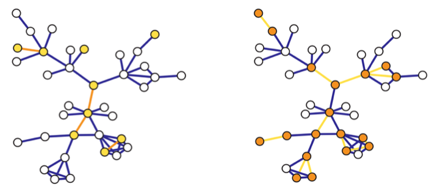
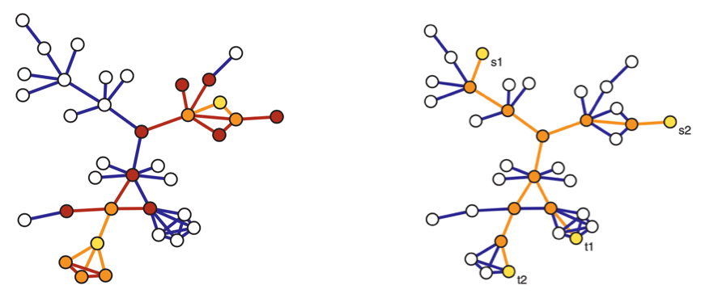

# Sampling and Estimation

Like other statistical data, we usually only observe a sample from a larger underlying graph. We introduce sampling and estimation in graphs.

Graph sampling designs are somewhat distinct from typical sampling designs in non-network contexts, in that there are effectively two inter-related sets $V$ and $E$ of units being sampled. Often these designs can be characterized as having two stages:
1. a selection stage, among one set (e.g. vertices)
2. an observation stage, among the other or both

It's also important to discuss the inclusion probabilities of a vertex and an edge in each sampling design, denoted $\pi_i$ for vertex $i \in E$ and $\pi_{(i, j)}$ for edge $(i,j) \in V^{(2)}$, where $V^{(2)}$ is the set of all unordered pairs of vertices.

## Induced Subgraph Sampling

The two stages are
1. Select a simple random sample of $n$ vertices $V^{*}=\left\{i_{1}, \ldots, i_{n}\right\}$ from $V$ without replacement
2. Observe a set $S^*$ of edges in their induced subgraphs: for $n(n-1)$ pairs of $(i, j)$ for $i,j \in V^*$, check whether $(i,j)\in E$.

For instance, in social networks, we an sample a group of individuals, and then ask their relation or some measure of contact, e.g. friendship, likes or dislike.

The inclusion probabilities are uniformly equal to

$$\begin{aligned}

\pi_{i}&= \mathbb{P}\left( v_i \text{ is selected}  \right) \\
&= \frac{n}{N_v} \\
\pi_{(i,j)}&= \mathbb{P}\left( \text{both $v_i$ and $v_j$ are selected}  \right) \\
&= \mathbb{P}\left( \text{$v_i$ is selected}  \right) \mathbb{P}\left( \text{$v_j$ is selected} \mid \text{$v_i$ is selected}  \right)\\
&= \frac{n}{N_v} \cdot \frac{n-1}{N_v - 1} \quad \because \text{without replacement}
\end{aligned}$$

Note that $N_v$ is necessary to compute these probabilities.

:::{figure} graph-sampling-induced-incident

Induced (left) and incident (right) subgraph sampling. Selected vertices/edges are shown in yellow, while observed edges/vertices are shown in orange.
:::

## Incident Subgraph Sampling

Complementary to induced subgraph sampling is incident subgraph sampling.
Instead of selecting $n$ vertices in the initial stage, $n$ edges are selected:
1. Select a simple random sample $E^*$ of $n$ edges from $E$ without replacement
2. All vertices incident to the selected edges are then observed, thus providing $V^*$.

For instance, we sample email correspondence from a database, and observe the sender and receiver.

Inclusion probabilities:

$$\begin{aligned}
\pi_{(i, j)} &= \frac{n}{N_e} \\
\pi_i&= 1-\mathbb{P}(\text{no edge incident to $v_i$ is selected}) \\
&=\left\{  

  \begin{array}{ll}\frac{\binom{N_e - d_i}{n}}{\binom{N_e}{n}} & \text { if } n \leq N_{e}-d_{i} \\ 1, & \text { if } n>N_{e}-d_{i}\end{array}\right. \\
\end{aligned}$$

Hence, in incident subgraph sampling, while the edges are included in the sample graph $G^*$ with equal probability, the vertices are included with unequal probabilities depending on their degrees.

Note that $N_e$ and $d_i$ are necessary to compute the inclusion probabilities. In the example of sampling email correspondence graph, this would require having access to marginal summaries of the total number of emails (say, in a given month) as well as the number of emails in which a
given sender had participated.

## Star Sampling

The first stage selects vertices like in induced subgraph sampling, but in the second stage, as its name suggests, we sample all edges incident to the selected vertices, as well as the new vertices on the other end.
1. Select a simple random sample $V_0^*$ from $V$ without replacement
2. For each $v \in V^*$,
   - observe all edges incident to $v$, yielding $E^*$.
   - also observe its neighbors, together with $V_0^*$ yielding $V^*$

More precisely, this is called labeled star sampling. In unlabeled star sampling, the resulting graph is $G^* = (V_0^*, E^*)$. In the latter case, we focus on some particular characteristics (e.g. degrees), so we don't need the vertices on the other end.

For instance, in co-authorship graph, randomly sampling records of $n$ authors and recording the total number of co-authors of each author would correspond to unlabeled star sampling; if not only the number but the identities of the co-authors are recorded, this would correspond to labeled star sampling.

The inclusion probabilities are

$$\begin{aligned}
\pi_{(i, j)}
&= \mathbb{P}\left( \text{neither $i$ nor $j$ are sampled}  \right)\\
&= 1- \frac{\binom{N_v-2}{n}}{\binom{N_v}{n}} \\
\pi_ i &= \frac{n}{N_v} \quad \text{unlabeled case}  \\
\pi_ i &= \sum_{L \subseteq N[i]}(-1)^{|L|+1} \mathbb{P}(L) \quad \text{labeled case}  \\
\end{aligned}$$

where
- $N[i]$ is the union of vertex $i$ and the its immediate neighbors
- $\mathbb{P}\left( L \right) = \frac{\binom{N_v - \left\vert L \right\vert}{n - \left\vert L \right\vert} }{\binom{N_v}{n} }$ is the probability that $L \subseteq V_0^*$. ($n > \left\vert L \right\vert$??)

## Snowball sampling

In star sampling we only look at the immediate neighborhood. We can extends it to up to the $K$-th order neighbors, which is snowball sampling. In short, a $K$-stage snowball sampling is
1. select a simple random sample $V_0^*$ from $V$ without replacement
2. for each $k = 1, \ldots , K$, observe a $k$-th order neighbors, add them to $V^*$ (excluding repeated vertices), and add their incident edges to $E^*$.

Formally, let $N(S)$ be the set of all neighbors of vertices in a set $S$. After we initialize $V_0^*$, we add vertices, for $k=1, \ldots, K$
- $V_k^* = N(V_{k-1}^*)\cap \bar{V}_0^* \cap \ldots \cap \bar{V}_{k-1}^*$, called the $k$-th wave.

A termination condition is $V_k = \emptyset$. The final graph $G^*$ consists of the vertices in $V^* = V_0^* \cup V_1 ^* \cup \ldots \cup V_K^*$ and their incident edges.

Unfortunately, although not surprisingly, inclusion probabilities for snowball sampling become increasingly intractable to calculate after the one-stage level corresponding to star sampling.

:::{figure} graph-sampling-link-tracing

Two-stage snowball sampling (left) where $V_0^*$ in yellow, $V_1^*$ in orange, and $V_2^*$ in red. Traceroute sampling (right) for sources $\left\{ s_1, s_2 \right\}$ and targets $\left\{ t_1, t_2 \right\}$ in yellow, observed vertices and edges in orange.
:::

## Link Tracing

Many of the other sampling designs fall under link tracing designs: after some selection of an initial sample, some **subset** of the edges ('links') from vertices in this sample are traced to additional vertices.

Snowball sampling is a special case of link tracing, in that all edges are observed. Sometimes this is not feasible, for example, in sampling social contact networks, it may be that individuals are unaware of or cannot recall all of their contacts, or that they do not wish to divulge some of them.

We introduce **traceroute** sampling.
1. select a random sample $S=\left\{s_{1}, \ldots, s_{n_{s}}\right\}$ of vertices as sources from $V$, and another random sample $T=\left\{t_{1}, \ldots, t_{n_{t}}\right\}$ of vertices as targets from $V \setminus S$.
2. For each pair $(s_i, t_j) \in S \times T$, sample a $s_i$-$t_j$ path. Observe all vertices and edges in the path, whose union yielding $G^* = (V^*, E^*)$.

To find the inclusion probabilities, we assume that the paths are shortest paths w.r.t. some set of edge weights. Dall'Asta et al. [SAND 107] find the probabilities are

$$\begin{aligned}
\pi_{i} &\approx 1-\left(1-\rho_{s}-\rho_{t}\right) \exp \left(-\rho_{s} \rho_{t} b_{i}\right) \\
\tau_{\{i, j\}} &\approx 1-\exp \left(-\rho_{s} \rho_{t} b_{i, j}\right)
\end{aligned}$$

where
- $b_i$ is the vertex betweenness centrality of vertex $i$
- $b_{i, j}$ is the edge betweenness centrality of edge $(i, j)$
- $\rho_{s} = \frac{n_s}{N_v} , \rho_t = \frac{n_t}{N_v}$ are the source ant target sampling fractions respectively

We see that the unequal probabilities varies with betweenness centrality $b_i$ and $b_{i, j}$. Though they are not calculable, they lend interesting insight into the nature of this sampling design, to be introduced later.

## Estimation

.

.

.

.

.

.

.

.
