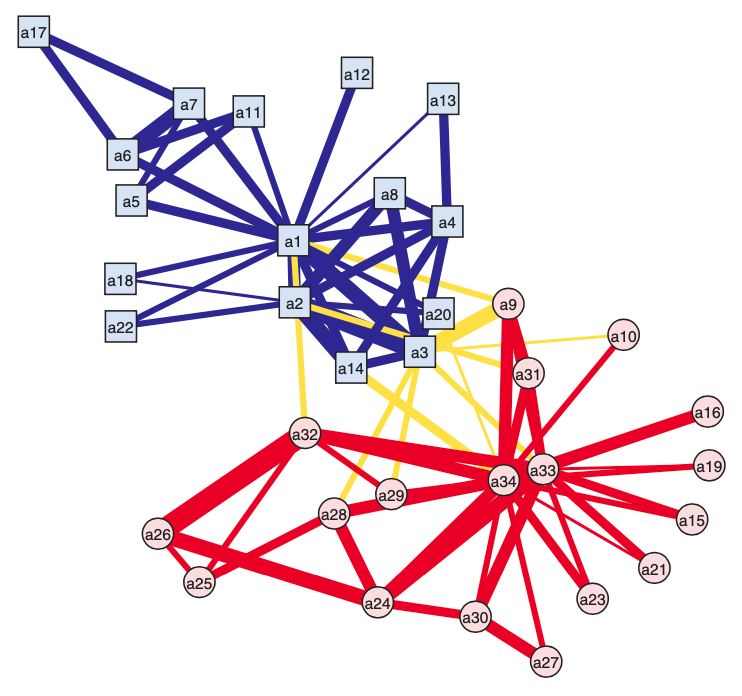
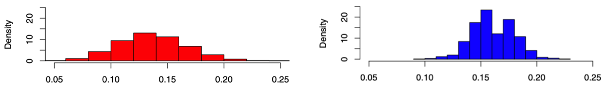

# Random Graph Models

## Background

By a model for a graph we mean a collection

$$
\left\{ \mathbb{P} \theta (G), G \in \mathcal{G}: \theta \in \Theta  \right\}
$$

where
- $\mathcal{G}$ is a collection ('ensemble') of possible graphs
- $\mathbb{P}_\theta$ is a probability distribution on $\mathcal{G}$
- $\theta$ is a vector of parameters ranging over values in $\Theta$.

### Estimate $\eta(G)$

In traditional statistical sampling theory, there are two main approaches to constructing estimates of population parameters $\eta(G)$ from a sample $G^*$: design-based and model-based.
- design-based: inference is based entirely on the random mechanism by which
a subset of elements were selected from the population to create the sample. We have see examples in the previous section.
- model-based approach: on the other hand, a model is given to specify a relationship between the sample and the population. Model-based estimation strategies including least-squares, method-of-moments, maximum-likelihood, etc are then used for constructing estimators for $\eta(G)$.

In more recent decades, the distinction between these two approaches has become more blurred.

### Assess Significance of $\eta(G^{obs})$

Suppose that we have a graph $G^{obs}$ derived from observations of some sort (i.e., **not** necessarily through a formal network sampling mechanism). We often interested in whether $\eta(G^{obs})$ is 'significant', in the sense that unusual or unexpected.

To measure this, we need a reference, like a 'null hypothesis' in hypothesis testing. A RGM can be used to create a reference distribution which, under the accompanying assumption of uniform likelihood of elements in $\mathcal{G}$, takes the form,

$$
\mathbb{P}_{\eta, \mathcal{G}} (t)  = \frac{\# \left\{ G \in \mathcal{G}: \eta(G) \le t \right\}}{\left\vert \mathcal{G} \right\vert}
$$

If $\eta(G^{obs})$ is found to be sufficiently unlikely under this distribution, this is taken as evidence **against** the hypothesis that Gobs is a uniform draw from $G$.

Some issues:
- How to choose $\mathcal{G}$?
- Usually it is not possible to enumerate all elements in $\mathcal{G}$, hence, cannot compute $\mathbb{P}_{\eta, \mathcal{G}} (t)$ exactly $\rightarrow$ sol: approximation.

## Classical Random Graph Models

### Erdos and Renyi

Equal probability on all graphs of a given order and size:

$$\mathcal{G} (N_v, N_e) = \left\{ G = (V, E): \left\vert V \right\vert = N_v, \left\vert E \right\vert = N_e\right\}$$

It is easy to find $\left\vert \mathcal{G} (N_v, N_e) \right\vert = \binom{\binom{N_v}{2}}{N_e}$, hence

$$\mathbb{P} (G) = \binom{\binom{N_v}{2}}{N_e} ^{-1}$$

### Gilbert

A collection $\mathcal{G} (N_v, p)$ is defined to consist of all graphs $G$ of order $N_v$ that may be obtained by assigning an edge **independently** to each pair of distinct vertices with probability $p$.

$$\mathcal{G} (N_v, p) = \left\{ G = (V, E): \left\vert V \right\vert = N_v, \left\vert E \right\vert = N_e\right\}$$

The level of connectivity is related to the relation between $p$ and $N_v$. Let $p = \frac{c}{N}$ for $c > 0$, then

- $c > 1$: w.h.p. $G$ will have a single connected component ('giant component') consisting of $\alpha_c N_v$ vertices, for some constant $\alpha_c > 0$, with the remaining components having only on the order of $\mathcal{O} (\log N_v)$ vertices.
- $c < 1$: w.h.p. all components will have on the order of $\mathcal{O} (\log N_v)$ vertices.

In term of degree distribution, w.h.p.

$$
(1-\varepsilon) \frac{c^{d} e^{-c}}{d !} \leq f_{d}(G) \leq(1+\varepsilon) \frac{c^{d} e^{-c}}{d !}
$$

That is, for large $N_v$, $G$ will have a degree distribution that is like a Poisson distribution with mean $c = p N_v$. This is intuitive since from the perspective of a vertex $i \in V$, it has edge $(i, j)$ w.p. $p$ for $N_v - 1$ number of $j$, hence its expected degree is $p(N_v - 1)$.

Thus, we observe
- **concentrated degree distribution** with exponentially decay tails, rather than broad degree distribution observed in many large-scale real-world networks.
- **low clustering**: recall that assortativity is the probability that two neighbors of a randomly chosen vertex are linked is just $p$, which tend to zero as $N_v$ grows.
- **small-world property**: the diameter of the graph very like $\mathcal{O} (\log N_v)$ w.h.p as $N_v \rightarrow \infty$.

## Generalized Random Graph Models

Equal probability on all graphs of a given order and some particular characteristic(s) $\eta^*$:

$$\mathcal{G} (N_v, \eta^*) = \left\{ G = (V, E): \left\vert V \right\vert = N_v, \eta(G) = \eta^*\right\}$$

Erdos Renyi random graph is a particular case of this, with $\eta^* = N_e$. $\eta^*$ can be more general, for instance, degree sequence $\left\{d_{(1)}, \ldots, d_{\left(N_{v}\right)}\right\}$ in ordered form. Note that since $N_v$ and $\bar{d}$ is fixed, due to $\bar{d} = \frac{2N_e}{N_v}$, then $N_e$ is also fixed. Hence, they form a subset of $\mathcal{G} (N_v, N_e)$.

Some results
- suppose $\eta$ is the first two moments of the degree distribution, under what condition will there be a giant component? [SAND 282, 283]
- suppose $\left\{ f_d \right\}$ has a power-law form $f_d = C d^{-\alpha}$,
  - under what condition will there be a giant component? [SAND 5]
  - if $\alpha \in (2,3)$, the diameter is $\mathcal{O} (\log N_v)$ and average distance $\mathcal{O} (\log \log N_v)$ w.h.p. under mild conditions [SAND 87]
  - if $\alpha \in (\frac{7}{3}, 3 )$, assortativity is $\mathcal{O} (N_v ^{- \beta})$ where $\beta = \frac{3\alpha - 7}{\alpha - 1}$, i.e. the rate is slower than $N_v ^{-1}$ [SAND 296.IV.B].

## Simulation

### Classical RGM

For some models it is actually possible to produce samples in linear time; for others, it appears that Markov chain Monte Carlo (MCMC) methods are the only realistic alternative.

- $\mathcal{G} (N_v, p)$

  A trivial solution is to store $\binom{N_v}{2} = \mathcal{O} (N_v^2)$ independent Bernoulli random variables, each with success probability $p$. When $p$ is small, majority of these variables will be $0$, hence $\mathcal{O} (N_v^2)$ seems a waste. Can we do better? Hint: for a given vertex $i$, consider a sequence of its $N_v-1$ neighbors $j$, such that $a_{ij} \sim \operatorname{Ber}(p)$, what's the expected number of 0's between two 1's?

- $\mathcal{G} (N_v, N_e)$

  It is more cumbersome to use the skipping trick above since edges are correlated: $\sum_{i\ne j=1}^n a_{ij} = N_e$. We simply draw $N_e$ number of distinct pairs from $(i, j) \in V^{(2)}, i\ne j$, which is a variant of coupon collector's problem with stopping criteria of reaching $N_e \le \binom{N_v}{2}$. This running time is $\mathcal{O} (N_v + N_e)$ in expectation.

See [Batagelj and Brandes](http://www.cosinproject.eu/publications/batagelj-pre71-2005.pdf).

### Generalized RGM

Sampling GRGM is more challenging since there are more constraints. We focus our discussion upon the case that the degree sequence $D = \left\{d_{(1)}, \ldots, d_{\left(N_{v}\right)}\right\}$ is be fixed.

#### Matching Algorithm

Input: $V, D$, output: $E$

- create a list containing $d_{(i)}$ copies of $v_{(1)}$

  $$
  L = \{ \underbrace{v_{(1)}, \ldots, v_{(1)}}_{d_{(1)} \text{ copies} }, v_{(2)}, \ldots, v_{(N_v)} \}
  $$

- randomly choose pairs of elements from $L$ into $E$, removing each pair from $L$ once chosen.
- return $E$

Obviously, there can be are multi-edges or loops in $E$, hence the corresponding graph is a multi-graph. If that's the case, just discard that graph and then repeat. Under appropriate conditions on the degree sequence, it can be argued that this algorithm will generate graphs from $\mathcal{G}$ with equal probability. See [SAND 282].

However, when the degree distribution is skewed, e.g. $d_{(1)}$ is large, it is quite likely to obtain repeated pairs $(v_{(1)}, v_{(j)})$ or $(v_{(1)}, v_{(1)})$. A solution is to monitor the pairs of vertices being selected and, if a candidate pair matches one in $E$, it is rejected and another candidate pair is selected instead. This modification will introduce **bias** into the sampling, and the graphs $G$ thus generated will no longer correspond to a strictly uniform sampling.

Alternatively, we can instead sample so as to avoid repeating existing matches in the first place. See [SAND 81] that developed for uniformly sampling $r \times c$ matrices $\boldsymbol{M}$ of non-negative integers with fixed marginal totals.

#### Switching Algorithm

Aka rewiring algorithms.

Switching algorithms begin with a graph that has the prescribed degree sequence, and then modify the connectivity of that graph through a succession of simple changes named 'switching': a pari of edges in the current graph $e_1 = (u_1, v_1)$ and $e_2 = (u_2, v_2)$ are randomly selected and replaced by the new edges $\left\{ u_1, v_2 \right\}$ and $\left\{ u_2, v_1 \right\}$. If either of the latter already exists, then the proposed switch is abandoned.

It falls within the realm of MCMC methods. In practice, it is typical to let the algorithm run for some time before beginning to collect sample graphs $G$. There is currently no  theory to indicate just how long of a preliminary period is necessary. Milo et al. [SAND 279] cite empirical evidence to suggest a factor of $100 N_e$ can be more than sufficient.

To ensure that the algorithm asymptotically yields strictly uniform sampling from $\mathcal{G}$, there are some certain formal conditions. See [SAND 322].

MCMC can be used to generate GRG uniformly from other types of collections $\mathcal{G}$ with additional characteristics beyond the degree sequence. However, that development of the corresponding theory, verifying the assumptions underlying Markov chain **convergence**, currently appears to lag far behind the pace of algorithm development.

## Application

### Hidden Population Size

In previous section we derived a design-based [estimator](sampling-hidden-pop-size) of hidden population size. Here, we describe a model-based estimator using random graphs.

Assume that the hidden population graph $G = (V, E)$ is from a collection $\mathcal{G} (N_v, p)$ of random graphs.

Note that now, $A_{ij}$ is also a random variables, i.e. $A_{ij} = \mathbb{I} \left\{ (i, j) \in E  \right\}$ with success probability $p$. Moreover, $A_{ij}$ are independent with $Z_i$. Hence, the moments are

$$
\begin{aligned}
\mathbb{E}\left(N_{v}^{*}\right) &=\mathbb{E}\left(\sum_{i} Z_{i}\right)=N_{v} p_{0} \\
\mathbb{E}\left(M_{1}\right) &=\mathbb{E}\left(\sum_{i \neq j} Z_{i} Z_{j} A_{i j}\right)= p_{0}^{2} \cdot N_v\left(N_{v}-1\right)p \\
\mathbb{E}\left(M_{2}\right) &=\mathbb{E}\left(\sum_{i \neq j} Z_{i}\left(1-Z_{j}\right) A_{i j}\right)= p_{0}\left(1-p_{0}\right) \cdot N_v\left(N_{v}-1\right)p
\end{aligned}
$$

After setting RHS equal to the observed values $n, m_1, m_2$ of LHS, we have

$$
\begin{aligned}
\hat{p}_{0} &=m_{1} /\left(m_{1}+m_{2}\right) \\
\hat{N}_{v} &=n\left(m_{1}+m_{2}\right) / m_{1}
\hat{p} &=m_{1}\left(m_{1}+m_{2}\right) / n\left[(n-1) m_{1}+n m_{2}\right] \\
\end{aligned}
$$

Note that the estimates of $p_0$ and $N_v$ are the same as those in the design-based method. There is another method using maximum conditional likelihood, see [SAND 154].

### Assessing Significance

As described, given $\eta(G^{obs})$, we want to find how in some sense unusual or unexpected it is. An important issue is determining which $\mathcal{G}$ to use as reference. For instance, to assess the significance of the number of distinct triangles in $G^{obs}$, a reasonable reference $\mathcal{G}$ should have the same number of edges as that of $G^{obs}$. In practice,
- it is common to control for the degree sequence observed in $G^{obs}$.
- sometimes also control other factors: if we knew that certain groups were present within the vertex set $V^{obs}$, we might wish to maintain the number of edges between and within each group.

For example, for an observed graph $G^{obs}$, we find that $\operatorname{clus}_T(G^{obs}) = 0.2257$. A reference collection $\mathcal{G}$ can be
1. $\mathcal{G} (N_v, N_e)$, or
2. $\mathcal{G} (N_v, N_e, d)$, where $d$ is the degree distribution.

Note $\left\vert \mathcal{G} (N_v, N_e) \right\vert = \binom{\binom{N_v}{2} }{N_e}$ is quite large, and $\left\vert \mathcal{G} (N_v, N_e, f_d) \right\vert$ is much smaller than the former but also large, we use MCMC to simulate the uniform sampling of $10,000$ random graphs $G$ from $\mathcal{G}$, and compute $\eta(G) = \operatorname{clus}_T(G)$

- in the first case, when the number of edges was fixed, only 3 of our 10,000 samples resulted in a graph with higher clustering coefficient,
- whereas in the second case, when the degree distribution was fixed, all of the samples resulted in lower clustering coefficient.

We therefore have strong evidence to reject the hypothesis that the network can be viewed as a uniform sample under either random graph model. As a result, we conclude that the network graph shows **markedly** greater transitivity than random graphs of comparable magnitude (i.e., with respect to order and size) or connectivity (i.e., with respect to degree distribution).

:::{figure} graph-karate

Observed graph of Zachary’s ‘karate club [Kolaczyk 2009]
:::

:::{figure} rgm-assess-clustering

Histograms of simulated clustering coefficients with fixed $N_v, N_e$ (left) and $f_d$ (right).
:::

It's also worth observing that the right distribution is bimodal.
- those in in the right-hand mode tended to often be characterized by two large and somewhat distinct clusters, as in the original network.
- those in the left appeared to have more diffuse clusters or even just one large cluster.

Meanwhile, for the $\mathcal{G} (N_v, N_e, d)$ case, due to conditioning on degree, coupled with the invariance of $\operatorname{clus} _T$ under isomorphism, the effective size of the sample space becomes quite small. In the 10,000 trials run, there were only 25 different values of $\operatorname{clus} _T$, and 17 of them takes 99% of the mass.
