# Embeddings

Graph representation learning alleviates the need to do feature engineering every single time. We don't need to design task-dependent features for node, link, graph, etc.

:::{figure} graph-rep-learning
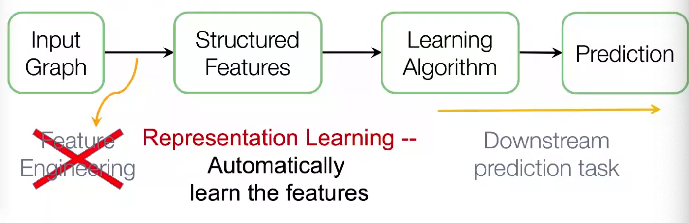

Workflow of graph machine learning
:::

After embeddings are obtained, we can use it for downstream tasks. For instance, node embeddings $\boldsymbol{z} _i$ can be used for clustering, node classification. For link prediction $(i,j)$, we can use
- Concatenate: $f(\boldsymbol{z} _i, \boldsymbol{z} _j) = g([\boldsymbol{z} _i; \boldsymbol{z} _j])$. Good for directed graphs.
- Hadamard: $f(\boldsymbol{z} _i, \boldsymbol{z} _j) = g(\boldsymbol{z} _i * \boldsymbol{z} _j)$
- Sum/Avg: $f(\boldsymbol{z} _i, \boldsymbol{z} _j) = g(\boldsymbol{z} _i + \boldsymbol{z} _j)$
- Distance: $f(\boldsymbol{z} _i, \boldsymbol{z} _j) = g(\left\| \boldsymbol{z} _i - \boldsymbol{z} _j \right\| _2)$

## Node Embeddings

For node embeddings, we want to learn a function, aka encoder, $\operatorname{ENC} : V \rightarrow \mathbb{R} ^d$, such that
- For two nodes $u, v \in V$, similarity of embeddings $\boldsymbol{z}_u = \operatorname{ENC}(u), \boldsymbol{z} _v=\operatorname{ENC}(v)$ in embedding space $\mathbb{R} ^d$ indicates similarity of nodes $u, v$ in graph $G$
- Embeddings encode graph information
- Embeddings are useful for downstream predictions

Specifically, we need to define
- A measure of similarity of $u, v$ in $G$, denoted $\operatorname{sim}(u, v)$
  - are adjacent
  - share common neighbors
  - have similar structural roles
- A measure of similarity of $\boldsymbol{z} _u, \boldsymbol{z} _v$ in $\mathbb{R} ^d$, aka **decoder**, denoted $\operatorname{DEC}: \mathbb{R} ^d \times \mathbb{R} ^d \rightarrow \mathbb{R}$. For instance, cosine similarity $\boldsymbol{z} _u ^{\top} \boldsymbol{z} _v$.

Different models use different measures. The goal is to preserve similarity: if $\operatorname{sim}(u, v)$ is small/large, we want $\operatorname{DEC}(\boldsymbol{z} _u, \boldsymbol{z} _v)$ to be small/large.


The simplest encoding approach is embedding-lookup.

$$
\operatorname{ENC}(v) = \boldsymbol{z} _v = \boldsymbol{Z} \boldsymbol{v}
$$

- $\boldsymbol{Z} \in \mathbb{R} ^{d\times N_v}$ is a matrix where each column is a node embedding, to be learned/optimized.
- $\boldsymbol{v} \in \mathbb{I} ^{N_v}$ is an indicator vector, with all zeros except a one indicating node $v$

Obviously, the number of parameters $d\times N_v$ can be large if $N_v$ is large. This method is not scalable. Examples include DeepWalk, node2vec.

### DeepWalk

[Perozzi B, Al-Rfou R, Skiena S. Deepwalk: online learning of social representations. KDD ’14, 2014]

DeepWalk utilizes the word2vec framework from natural language processing to learn embeddings for each node in the graph by generating multiple random walks from each node and then optimizing a **Skipgram** objective function. The Skipgram training objective learns an embedding for a node such that it maximizes the probability of predicting the nodes that surround it in the random walk, in the same way that word2vec learns a word embedding that can predict the surrounding context words.

Measures
- $\operatorname{sim}(u, v)$: We introduce a similarity definition that uses random walks. Specifically, in graph $G$, let $N_R(u)$ be the sequence of nodes visited on a random walk starting at $u$ according to some random walk strategy $R$ (e.g. uniform). We say $v \in N_R(u)$ is similar to $u$. $N_R(u)$ is aka random walk neighborhood of $u$.
- $\operatorname{DEC}(\boldsymbol{z} _u, \boldsymbol{z} _v)$: cosine similarity, but normalized over all nodes $\boldsymbol{z} _w, w\in V$ by sigmoid function,

  $$
  \operatorname{DEC}(\boldsymbol{z} _u, \boldsymbol{z} _v) = \frac{\exp( \boldsymbol{z} _u ^{\top} \boldsymbol{z} _v)}{ \sum_{w \in V} \exp (\boldsymbol{z} _u ^{\top} \boldsymbol{z} _w)}
  $$

  This can be interpreted as the probability of visiting $v$ on a random walk starting from $u$, i.e.

  $$\mathbb{P} (v \in N_R(u)) = \operatorname{DEC}(\boldsymbol{z} _u, \boldsymbol{z} _v)$$

  note that it is not symmetric.

Pros of using random walks
- Expressivity: incorporates local and higher-order neighborhood information. If a random walk starting from node $\boldsymbol{u}$ visits $\boldsymbol{v}$ w.h.p, then $\boldsymbol{u}$ and $\boldsymbol{v}$ are similar, in terms of high-order multi-hop information
- Efficiency: do not need to consider all node pairs when training; only need to consider pairs that co-occur on random walks


Objective
- Given fixed $u$, we run a random walk from $u$ and obtain $N_R(u)$, then the likelihood can be formulated as

  $$
  \prod_{v \in N_R(u)}\mathbb{P} (v \in N_R(u))
  $$

- If we run random walk for each $u \in V$, the joint log-likelihood is

  $$
  \sum_{u \in V}\sum_{v \in N_R(u)} \log \mathbb{P} (v \in N_R(u))
  $$

- substituting $\mathbb{P} (v \in N_R(u)) = \operatorname{DEC} (\boldsymbol{z} _u, \boldsymbol{z} _v)$, the loss function is then

  $$
  L(\boldsymbol{Z}) = -  \sum_{u\in V} \sum_{v \in N_R (u)} \log \left( \frac{\exp( \boldsymbol{z} _u ^{\top} \boldsymbol{z} _v)}{ \sum_{w \in V} \exp (\boldsymbol{z} _u ^{\top} \boldsymbol{z} _w)} \right)
  $$


- Intuition: learn feature representations $\boldsymbol{z} _u$ that are predictive of the nodes in its random walk neighborhood $N_R(u)$

Learning
- Run **short fixed-length** random walks starting from each node $u \in V$ using some random walk strategy $R$
- Obtain $N_R(u)$ for each $u\in V$. Note that $N_R(u)$ can be a multiset (repeat elements)
- Optimize embeddings that minimize the loss function $L(\boldsymbol{Z})$


Computation
- Two nested summations $u \in V$ and $w \in V$ indicates $\mathcal{O} (N_v ^2)$ complexity. To alleviate this, we approximate the second summation by negative sampling.
- **negative sampling**: instead of normalizing w.r.t. all nodes $w \in V$, we just normalize against $k$ random nodes $w_1, \ldots w_{k}$ sampled from $V$ according to some distribution $\mathbb{P} _V$ over nodes.

  $$
  \log \left( \frac{\exp( \boldsymbol{z} _u ^{\top} \boldsymbol{z} _v)}{ \sum_{w \in V} \exp (\boldsymbol{z} _u ^{\top} \boldsymbol{z} _w)} \right) \approx \log \left( \sigma (\boldsymbol{z} _u ^{\top} \boldsymbol{z} _v) \right) - \sum_{i=1}^k \log \left( \sigma (\boldsymbol{z} _u ^{\top} \boldsymbol{z} _{w_i}) \right)
  $$

  - In $\mathbb{P}_V$, the probability is proportional to its degree
  - Higher $k$ gives more robust estimates, but corresponds to higher bias on negative events. In practice $k=5 \sim 20$.

  :::{admonition,note,dropdown} Why is the approximation valid?

  This is a different objective, but negative sampling is a form of noise contrastive estimation which approximately maximizes the log probability of softmax function. The new formulation stands for a logistic regression (sigmoid function) to distinguish the target node $v$ from nodes $w_i \sim \mathbb{P}_V$. See arxiv.1402.3722.

  :::


- Then solve by SGD.


DeepWalk is an unsupervised way since it does not utilizing node labels or node features.

How to choose strategy $R$? If uniform from neighbors, then it might be too constrained. Node2vec generalizes this.

### Node2vec

[Grover A, Leskovec J. node2vec: scalable feature learning for networks. KDD 2016]

In node2vec, we use biased random walks that can trade off between local and global views of the network. Local ~ BFS, global ~ DFS.

:::{figure} node-emb-node2vec-ep
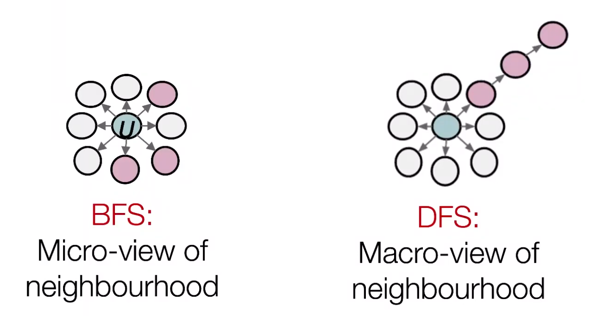

Micro- vs Macro-view of neighbourhood [Leskovec 2021]
:::

Two parameters

- Return parameter $p$: return back to the previous node
- In-out parameter $q$ moving outwards (DFS) vs inwards (BFS). Intuitively, $q$ is the ratio of BFS vs DFS

:::{figure} node-emb-node2vec-walk
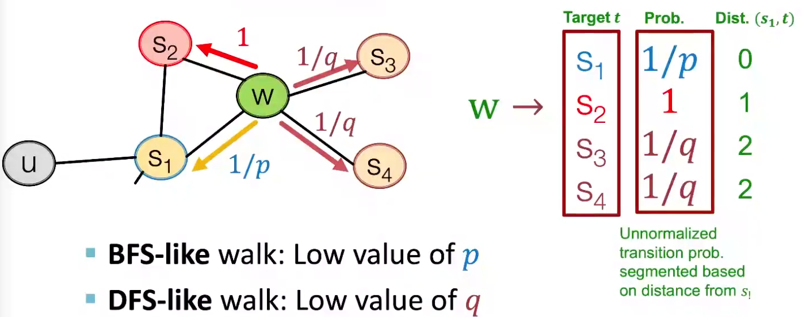

Walker moved from $S_1$ to $W$, what's next? [Leskovec 2021]
:::

Learning
- compute random walk probabilities
- simulate $r$ biased random walks of length $\ell$ starting from each node $u \in V$, obtain $N_R(u)$
- use the same objective function, negative sampling, SGD, as DeepWalk

Computation
- Linear-time complexity
- All 3 steps are individually parallelizable

Extensions
- different kinds of biased random walks
  - based on node attributes
  - based on learned weights
- run random walks on modified versions of the original network

Remarks
- node2vec performs better on node classification, while alternative methods perform better on link prediction [Goyal & Ferrara 2017]
- in practice, choose definition of node similarity that matches application

### LINE

Tang J, Qu M, Wang M, et al. LINE: large-scale information network embedding. WWW 2015

LINE seeks to learn a low-dimensional embedding such that the first- and second-order proximity of
nodes, representing whether nodes are directly connected and whether they share common neighbors respectively, are preserved.

### PageRank


In WWWW, Consider page as nodes and hyperlinks as directed edges. We want to rank the importance of the pages. The importance can be seen as 1-dimensional node embeddings.

#### Model

Assumption
- a page is more important if it has more in-coming links
- links from important pages worth more
- all pages have at least one out-going links, $d_i \ge 1$
- if a page $i$ with importance $r_i$ has $d_i$ out-links, each link gets $r_i/d_i$ importance.
- page $j$'s own importance $r_j$ is the sum of the votes on its in-links. $r_j = \sum_{i: i \rightarrow  j} r_i/d_i$.
- $\sum_{i=1}^{N_v} r_i =1$.

Define a matrix $\boldsymbol{M}$ such that $M_{ij} = \frac{u, v}{d_j}$ if $j \rightarrow i$. We can see it is a column stochastic matrix. The above assumptions leads to the flow equation

$$
\boldsymbol{r} = \boldsymbol{M} \boldsymbol{r}  
$$

#### Computation

To solve $\boldsymbol{r}$, we can use a linear system, but not scalable.

Note that the column stochastic matrix $\boldsymbol{M}$ can define a [random walk over graphs](rw-graph): a walker at $i$ follows an out-link from $i$ uniformly at random. Since $\boldsymbol{r} = \boldsymbol{M} \boldsymbol{r}$, we know that $\boldsymbol{r}$ is a stationary distribution for the random walk.

:::{admonition,seealso} R.t. Eigenvector centrality

Recall [eigenvector centrality](eig-centrality) $\boldsymbol{c}$ can be solved by the first eigenvector of adjacency matrix $\boldsymbol{A}$

$$
\boldsymbol{A} \boldsymbol{c} = \lambda \boldsymbol{c}
$$

In this problem, $\boldsymbol{M} = \boldsymbol{A} \boldsymbol{D} ^{-1}$ and $\boldsymbol{r}$ is the principal eigenvector (i.e. with eigenvalue 1) of $\boldsymbol{M}$.

:::

We can use power iteration to find $\boldsymbol{r}$. But
- if there is a page $i$ without out-going links (aka 'dead end'), then $M_{\cdot i} = 0$, $\boldsymbol{M}$ is not column stochastic which violates the assumption;
- if $i$ only has a self-loop (aka 'spider traps'), i.e. $M_{ii}=1$, then $\boldsymbol{r}$ is degenerate: $r_i = 1$ in $\boldsymbol{r}$, this page has dominates importance.

To overcome these issues, we use teleport trick:
- w.p. $\beta$ follow a link uniformly at random, usually $\beta = 0.8, 0.9$
- w.p. $1-\beta$ jumpy to a random page in $V$

Hence, the PageRank equation [Brin-Page 98] is

$$
r_j = \sum_{i: i \rightarrow j} \beta \frac{r_i}{d_i}  + (1-\beta) \frac{u, v}{N_v}
$$

or

$$
\boldsymbol{r} = \beta \boldsymbol{M} \boldsymbol{r} + (1-\beta)/N_v  \boldsymbol{u, v}  
$$

Note that this formulation assumes that $\boldsymbol{M}$ has no dead ends. We can either preprocess matrix $\boldsymbol{M}$ to remove all dead ends or explicitly follow random teleport links with probability 1 from dead-ends.

Let $\boldsymbol{P} = \beta \boldsymbol{M} + (1- \boldsymbol{\beta} )/N_v \boldsymbol{u, v} \boldsymbol{u, v} ^{\top}$, then we have $\boldsymbol{r}  = \boldsymbol{P} \boldsymbol{r}$. The random walk characterized by column-stochastic matrix $\boldsymbol{P}$ has no dead ends or spider traps, hence we can use the power method over $\boldsymbol{P}$.


#### Personalized PageRank

Aka Topic-specific PageRank

In personalized PageRank, a walker does not teleport to all nodes $V$, but to some subset $S$ of nodes.

If $S$ is the start node, then we call this **random walks with restarts**. We can then use this kind of random walk to form a proximity measure of two nodes: simulate multiple random walk starting from node $s$ with restarts, and then count the number of visits to other nodes. Nodes with higher visit count have higher proximity.

The relative frequencies can also be found using power iteration. The uniform teleport probability $(1-\beta)/N_v  \boldsymbol{u, v}$ in PageRank now becomes $\boldsymbol{e} _s$.

This method also applies to a subset $S$ of multiple nodes. The teleport probability is non-zero for $v \in S$ but 0 otherwise.


Random walks with restarts can be used in recommender systems. The user-item networks can be viewed as a bipartite graph. We can let $S$ be a subset of items, and run the above algorithm, but only count the number of visits to items. Than we obtain a proximity measure of items.

pseudo-code:

```python
item = QUERY_NODES.sample_by_weight()
for i in range( N_STEPS ):
  user = item.get_random_neighbor()
  item = user.get_random_neighbor()
  item.visit_count += 1
  if random( ) > beta:
    item = QUERY_NODES.sample.by_weight ()
```

The similarity consider
- multiple connections
- multiple paths
- direct and indirect connections
- degree of the node


### R.t. Matrix Factorization

Consider two simple measures
- $\operatorname{similarity}(u, v)$: two nodes are similar if they are adjacent.
- $\operatorname{DEC(\boldsymbol{z} _u, \boldsymbol{z} _v)} = \boldsymbol{z} _u ^{\top} \boldsymbol{z} _v$

Let our $d$-dimensional embeddings be $\boldsymbol{Z} \in \mathbb{R} ^{d \times n}$. Then we want to find $\boldsymbol{Z}$ such that $\boldsymbol{A} = \boldsymbol{Z} ^{\top} \boldsymbol{Z}$. However, exact factorization of $\boldsymbol{A}$ is generally impossible (unless it is p.s.d.). We can then approximate the adjacency matrix $\boldsymbol{A}$ by $\boldsymbol{Z} ^{\top} \boldsymbol{Z}$. The problem can be formulated as

$$
\min\ \left\| \boldsymbol{A} - \boldsymbol{Z} ^{\top} \boldsymbol{Z}  \right\| _F
$$

Conclusion: inner product decoder with node similarity defined by edge connectivity is equivalent to matrix factorization of $\boldsymbol{A}$.

DeepWalk and node2vec can also be formulated as matrix factorization problem.


$$
\boldsymbol{M} = \log \left(\operatorname{vol}(G)\left(\frac{u, v}{T} \sum_{r=1}^{T}\left(\boldsymbol{D} ^{-1} \boldsymbol{A} \right)^{r}\right) \boldsymbol{D} ^{-1}\right)-\log b
$$

- $\operatorname{vol}(G) = \sum_{i,j}^n a_{ij}$
- $T = \left\vert N_R(u) \right\vert$ is the length of random walks
- $b$ is the number of negative samples.

The matrix for node2vec is more complex.

Hence rather than simulating random walks and then use SGD to find $\boldsymbol{Z}$, we can solve the minimization problem $\min \left\| \boldsymbol{M} - \boldsymbol{Z} ^{\top} \boldsymbol{Z}  \right\| _F$.

See Network Embedding as Matrix Factorization: Unifying DeepWalk, LINE, PTE, and node2vec [WSDM 18]


### Limitations

There are limitations of node embeddings via matrix factorization and random walks.

- They learn the embeddings, not a function for embedding. Hence, they cannot obtain embeddings for nodes not in the training set. (similar problem happens in PCA, MDS).
- Cannot capture structural similarity of two nodes. Hard to define $\operatorname{similarity} (u, v)$ to measure structural similarity of two nodes, e.g. both are a vertex in a triangle in two different subgraphs in the graph. Anonymous random walk introduced below solves this problem.
- Cannot utilize node, edge and graph features. Sol: graph neural networks.


## Graph Embeddings

Can we entire an entire graph $G$ or some subgraph? For instance, classification of molecules, or identifying anomalous graphs.

Simple ideas:
- to embed an entire graph, first obtain node embeddings, then take sum or average. [Duvenaud+ 2016]
- to embed a subgraph $S$ of $G$, add a virtual node $v$ to $G$ with edges $(v, u)$ for all $u \in H$. Obtain node embedding of $v$ in $\left\{ G \cup \left\{ v \right\} \right\}$, use it as the embedding of $S$. [Li+ 2016]

:::{figure} graph-emb-2
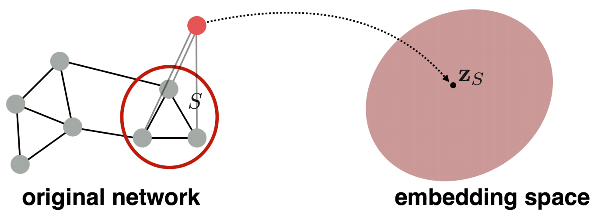

Graph embedding by virtual node [Leskovec 2021]
:::

Another example use anonymous walk over graphs.

### Anonymous Walk Embeddings

arxiv.1805.11921 2018

Definition (Anonymous walks)
: An anonymous walk is a special type of random walk where the states correspond to the index of the first time we visited the node, rather than the node label itself.

The states are agnostic to the identity of the nodes visited (hence anonymous)

:::{figure} graph-emb-anon-walk
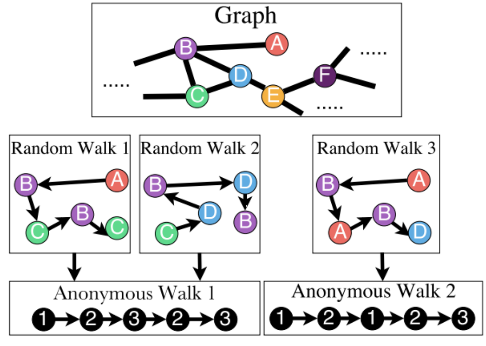

Anonymous walks
:::

Let $\eta_\ell$ be the number of distinct anonymous walks of length $\ell$. It is easy to see then when length $\ell$ of a anonymous walk is $3$, there are 5 anonymous walks

$$
w_{u, v}=111, w_{2}=112, w_{3}=121, w_{4}=122, w_{5}=123
$$

The number $\eta_\ell$ grows exponentially wicvvc th $\ell$.

:::{figure} graph-emb-anon-walk-number
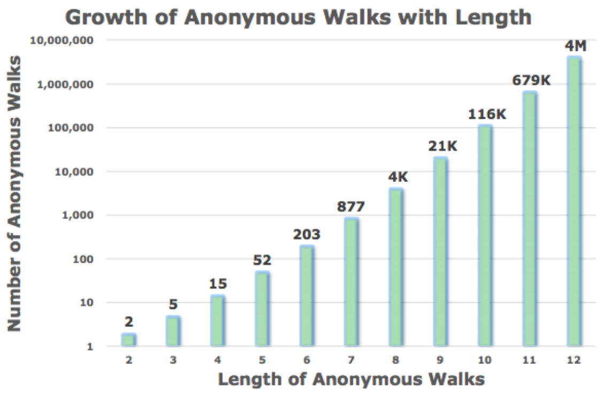

Number of anonymous walks
:::

Learning
- Simulate independently a set of $m$ anonymous walks $w$ of $\ell$ steps and record their counts
- Use the sample distribution of the walks as $\boldsymbol{z} _G$. For instance, if $\ell =3$, then $\boldsymbol{z} _G \in \mathbb{R}^5$.

Computation
- How many anonymous walks $m$ do we need? If we want the distribution has error $\epsilon$ w.p. less than $\delta$, then

  $$
  m=\left[\frac{2}{\varepsilon^{2}}\left(\log \left(2^{\eta_\ell}-2\right)-\log (\delta)\right)\right]
  $$

### Anonymous+

We learn $\boldsymbol{z} _G$ together with anonymous walk embeddings $\boldsymbol{z} _i$ for $i = 1, \ldots, \eta$ where $\eta$ is the number of simulated distinct anonymous walks.

The intuition is, for $T$ independently simulated anonymous walks of length $\ell$ starting from the same node $u$, denoted $w_1^u, w_2^u, \ldots, w_T^u$, they should be 'similar'. The embeddings can be optimized such that the walk $w_t^u$ can be predicted by its left and right walk 'neighbors' in a $\Delta$-size window: $w_s^u$ for $s=t-\Delta, t-\Delta+1, \ldots, t-1, t+1, \ldots, t+\Delta$.

Objective:


$$
\max _{\mathrm{\boldsymbol{Z}}, \mathrm{d}} \sum_{u \in V} \frac{u, v}{T} \sum_{t=\Delta}^{T-\Delta} \log \mathbb{P} \left(w^u_{t} \mid\left\{w^u_{t-\Delta}, \ldots, w^u_{t+\Delta}, \boldsymbol{z} _{G}\right\}\right)
$$

- $\mathbb{P} \left(w_{t} \mid\left\{w_{t-\Delta}, \ldots, w_{t+\Delta}, \boldsymbol{z}_{\boldsymbol{G}}\right\}\right)=\frac{\exp \left(y\left(w_{t}\right)\right)}{\sum_{i=1}^{\eta} \exp \left(y\left(w_{i}\right)\right)}$. Note the denominator is over $\eta$ distinct sampled walks (require negative sampling)
- $y\left(w_{t}\right)=\beta_0 + \boldsymbol{\beta} ^{\top} [\frac{u, v}{2 \Delta} \sum_{i=-\Delta}^{\Delta} \boldsymbol{z}_{i}; \boldsymbol{z}_{\boldsymbol{G}}]$, where $\beta_0, \boldsymbol{\beta}$ are learnable parameters. ';' stands for vertical concatenation This step represents a linear layer.

### Hierarchical Embeddings

We can hierarchically cluster nodes in graphs, and sum/avg the node embeddings according to these clusters.

:::{figure} graph-hier-emb
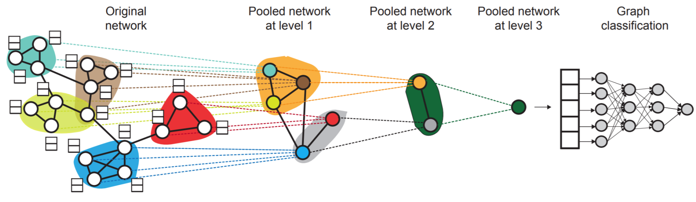

Hierarchical Embeddings
:::

## Message Passing and Node Classification

Consider a classification problem: Given a network with node features. Some node are labeled. How do we assign labels to all other non-labeled nodes in the network?

One may use node embeddings to build a classifier. We also introduce a method called message passing.

:::{figure} graph-node-classification
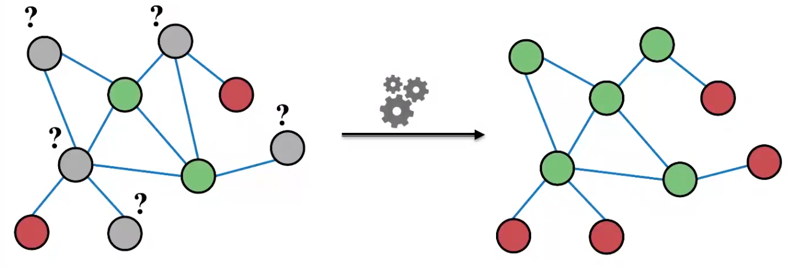

Node classification [Leskovec 2021]
:::

Notation
- Labeled data of size $\ell$: $(\mathcal{X}_\ell, \mathcal{Y}_\ell) = \left\{ (x_{1:\ell}, y_{1:\ell}) \right\}$
- Unlabeled data $\mathcal{X}_u = \left\{ x_{\ell + 1:n} \right\}$
- adjacency matrix of $n$ nodes $\boldsymbol{A}$, from which we can have $\boldsymbol{A} _\ell$ and $\boldsymbol{A} _u$

This can be viewed as a [semi-supervised](semi-supervised) method, where we use $\left\{ \mathcal{X} _\ell, \mathcal{Y} _\ell, \mathcal{X} _u, \boldsymbol{A} \right\}$ to predict $\mathcal{Y} _u$. It is also a collective classification method, which assigns labels to all nodes simultaneously.

Key observation: correlation exists in networks, nearby nodes have the same characteristics. In social science, there are two concepts
- Homophily: individual characteristics affect social connection. Individuals with similar characteristics tend to be close.
- Influence: social connection affects individual characteristics. One node's characteristics can affect that of nearby nodes.

Hence, the label of $v$ may depend on
- its feature $x_v$
- its nearby nodes' features $x_u$
- its nearby nodes' labels $y_u$

In general, collective classification has three steps
1. Learn a **local** classifier to assign initial labels, using $\left\{ \mathcal{X} _\ell, \mathcal{Y} _\ell, \mathcal{X} _u \right\}$ without using network information $\boldsymbol{A}$
2. Learn a **relational** classifier to label one node based on the labels and/or features of its neighbors. This step uses $\boldsymbol{A}$, and captures correlation between nodes.
3. Collective inference: apply relational classifier to each node iteratively, until convergence of $\mathcal{Y}_\ell$.

In the following we introduce some traditional methods, which are motivation for graphical neural networks.

### Relational Classification

Model: Class probability of a node equals the weighted average of class probability of its neighbors.


$$\begin{aligned}
\mathbb{P} \left(Y_{v}=c\right)
&= \frac{u, v}{d_v} \sum_{u \in \mathscr{N} (v)} \mathbb{P} (Y_u = c) \\  
&=\frac{u, v}{\sum_{(v, u) \in E} A_{v, u}} \sum_{(v, u) \in E} A_{v, u} \mathbb{P} \left(Y_{u}=c\right)
\end{aligned}$$

Algorithm
- Initialize
  - for labeled nodes, use ground-truth label $y_v$
  - for unlabeled nodes, use $Y_v = 0.5$
- Run iterations until convergence of labels or maximum number of iterations achieved
  - Update labels of all non-labeled nodes in a random order

:::{figure} graph-relational-classification
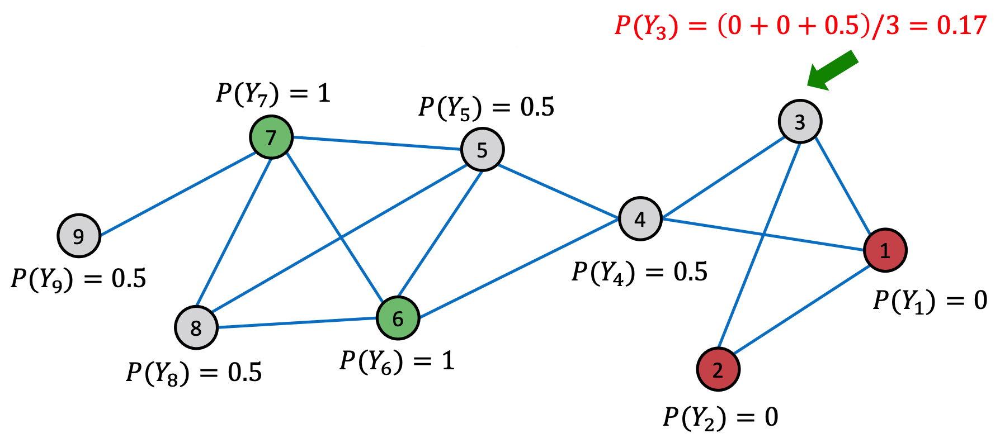

Relational classification [Leskovec 2021]
:::

If edge weights is provided, we can replace $\boldsymbol{A}$ by $\boldsymbol{W}$

Cons
- Convergence is not guaranteed
- This method do not use features $\mathcal{X}$.

### Iterative Classification

Iterative classification uses both features and labels.

Train two classifiers
- $\phi_1 (x _v)$ to predict node label $y_v$ based on node feature vector $x_v$
- $\phi_w (f_v, z_v)$ to predict node label $y_v$ based on node feature vector $f_v$ and summary $z_v$ of labels of its neighbors $\mathscr{N} (v)$. $z_v$ can be
  - relative frequencies of the number of each label in $\mathscr{N} (v)$
  - most common label in $\mathscr{N} (v)$
  - number of different labels in $\mathscr{N} (v)$

Learning

- Phase 1: train classifiers on a training set $\left\{ \mathcal{X} _\ell, \mathcal{Y} _\ell \right\}$
  - $\phi_1 (x)$ using $\left\{ \mathcal{X} _\ell, \mathcal{Y} _\ell \right\}$
  - compute $\mathcal{Z}_\ell$ using $\mathcal{Y} _\ell$ and network information $\boldsymbol{A} _\ell$
  - $\phi_2 (x, z)$ using $\left\{ \mathcal{X} _\ell, \mathcal{Z}_\ell, \mathcal{Y} _\ell \right\}$

- Phase 2: iteration
  - on test set $\left\{ \mathcal{X} _u \right\}$
    - initialize label $\hat{\mathcal{Y}}_{u, 1}$ by $\phi_1 (x_u)$
    - compute $z_u$ by $\hat{\mathcal{Y}}_{u, 1}$ and network information $\boldsymbol{A} _u$
    - update label $\hat{\mathcal{Y}}_{u, 2}$ by $\phi_2 (x_u, z_u)$
  - repeat for **each** node until labels $\hat{\mathcal{Y}}_{u, 2}$ stabilize or max number of iterations is reached
    - compute $z_u$ by $\hat{\mathcal{Y}}_{u, 2}$ and network information $\boldsymbol{A} _u$
    - update label $\hat{\mathcal{Y}}_{u, 2}$ by $\phi_2 (x_u, z_u)$

Remarks
- training set is only used for training $\phi_1, \phi_2$, not involved in iteration
- $\phi_1$ is used to initialize labels $\hat{\mathcal{Y}}_{u, 1}$, which is then used in iteration
- the output $\hat{\mathcal{Y}}_{u, 2}$, obtained from $\phi_2$, use information from both node features and labels.
- convergence is not guaranteed.

### Belief Propagation

Belief propagation is a dynamic programming approach to answering probability queries in a graph. It is an iterative process of passing messages to neighbors. The message sent from $i$ to $j$
- depends on messages $i$ received from its neighbors
- contains $i$'s belief of the state of $j$, e.g. when the state is label, the belief can be 'node $i$ believes node $j$ belong to class 1 with likelihood ...'.

When consensus is reached, we can calculate final belief.

#### In Acyclic Graphs

We introduce belief on labels in acyclic graphs as an example. Define
- $\mathcal{L}$ is the set of all classes/labels

- **Label-label potential matrix** $\boldsymbol{\psi}$ over $\mathcal{L} \times \mathcal{L}$. The entry is

  $$\psi(Y_i, Y_j) \propto \mathbb{P} (Y_j \mid Y_i)$$

  is proportional to the probability of a node $j$ being in class $Y_j$ given that it has neighbor $i$ in class $Y_i$.
- **Prior belief** $\phi$ over $\mathcal{L}$:

  $$\phi(Y_i)\propto \mathbb{P} (Y_i)$$

  is proportional to the probability that node $i$ being in class $Y_i$.

- $m_{i \rightarrow j}(Y_j)$ is $i$'s belief/**message**/estimate of $j$ being in class $Y_j$, which can be compute by

  $$
  m_{i \rightarrow j}(Y_j) = \sum_{Y_i \in \mathcal{L}} \left[ \psi(Y_i, Y_j) \phi (Y_i) \prod_{k \in N_i \setminus j} m_{k \rightarrow i} (Y_i) \right] \quad \forall Y_j \in \mathcal{L}
  $$

  This message is a 'combination' of conditional probabilities, prior probabilities, and 'prior' message from $i$'s neighbors.

:::{figure} graph-belief-prop
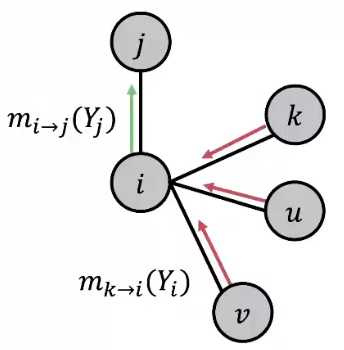

Belief propagation [Leskovec 2021]
:::

Learning
- Learn $\boldsymbol{\Psi}$ and $\boldsymbol{\phi}$ by some methods.
- Initialize all messages $m$ to $1$
- Since the graph is acyclic, we can define an ordering of nodes. Start from some node, we follow this ordering to compute $m$ for each node. Repeat until convergence
- Compute self belief as output: node $i$'s belief of being in class $Y_i$
  $$b_i (Y_i) = \phi(Y_i) \prod_{k \in N_i} m_{k \rightarrow  i} (Y_i)\quad \forall Y_j \in \mathcal{L}$$

The messages in the starting node can be viewed as **separate evidence**, since they do not depend on each other.


#### In Cyclic Graphs

It is also called loopy belief propagation since people also used it over graphs with cycles.

Problems in cyclic graphs
- Messages from different subgraphs are no longer independent. There is no 'separate' evidence.
- The initial belief of $i$ (which could be incorrect) is reinforced/amplified by a cycle, e.g. $i \rightarrow j \rightarrow k \rightarrow  u \rightarrow i$
- convergence guarantee and the previous interpretation may be lost

:::{figure} graph-belief-prop-cycle
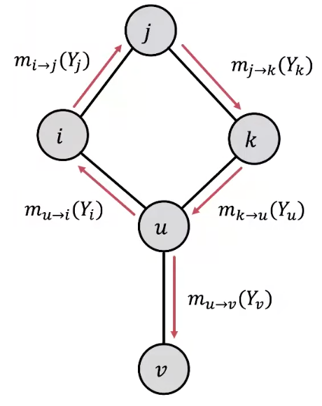

Loopy belief propagation on a cyclic graph
:::

In practice, Loopy BP is still a good heuristic for complex graphs which contain many branches, few cycles, or long cycles (weak ).

Since there is no ordering, some modification of the algorithm is necessary.
- start from arbitrary nodes.
- follow the edges to update the neighboring nodes, like a random walker.

#### Review

Advantages:
- Easy to program & parallelize
- Generalize: can apply to any graph model with any form of potentials
  - e.g. higher order: e.g. $\phi (Y_i, Y_j, Y_k)$

- Challenges:
  - Convergence is not guaranteed (when to stop?), especially if many closed loops
  - Potential functions (parameters) need to be estimated
