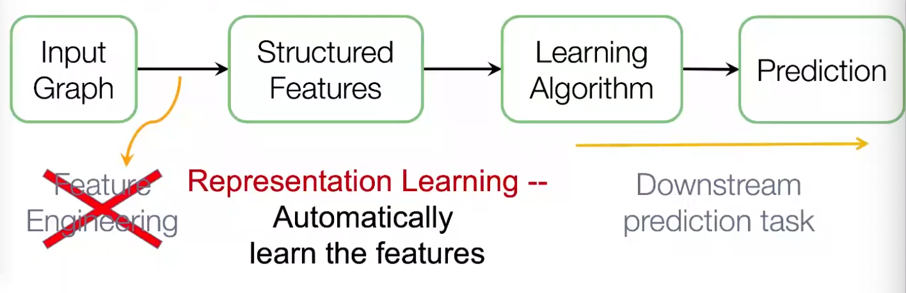
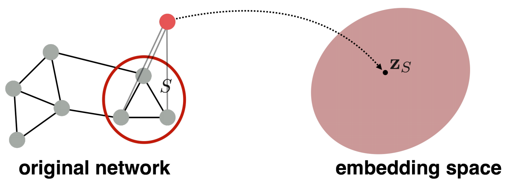

# Graph Representation Learning

Graph representation learning alleviates the need to do feature engineering every single time. We don't need to design task-dependent features for node, link, graph, etc.

:::{figure} graph-rep-learning

Workflow of graph machine learning
:::

After embeddings are obtained, we can use it for downstream tasks. For instance, node embeddings $\boldsymbol{z} _i$ can be used for clustering, node classification. For link prediction $(i,j)$, we can use
- Concatenate: $f(\boldsymbol{z} _i, \boldsymbol{z} _j) = g([\boldsymbol{z} _i; \boldsymbol{z} _j])$. Good for directed graphs.
- Hadamard: $f(\boldsymbol{z} _i, \boldsymbol{z} _j) = g(\boldsymbol{z} _i * \boldsymbol{z} _j)$
- Sum/Avg: $f(\boldsymbol{z} _i, \boldsymbol{z} _j) = g(\boldsymbol{z} _i + \boldsymbol{z} _j)$
- Distance: $f(\boldsymbol{z} _i, \boldsymbol{z} _j) = g(\left\| \boldsymbol{z} _i - \boldsymbol{z} _j \right\| _2)$

## Node Embeddings

For node embeddings, we want to learn a function, aka encoder, $\operatorname{ENC} : V \rightarrow \mathbb{R} ^d$, such that
- For two nodes $u, v \in V$, similarity of embeddings $\boldsymbol{z}_u = \operatorname{ENC}(u), \boldsymbol{z} _v=\operatorname{ENC}(v)$ in embedding space $\mathbb{R} ^d$ indicates similarity of nodes $u, v$ in graph $G$
- Embeddings encode graph information
- Embeddings are useful for downstream predictions

Specifically, we need to define
- A measure of similarity of $u, v$ in $G$, denoted $\operatorname{sim}(u, v)$
  - are adjacent
  - share common neighbors
  - have similar structural roles
- A measure of similarity of $\boldsymbol{z} _u, \boldsymbol{z} _v$ in $\mathbb{R} ^d$, aka **decoder**, denoted $\operatorname{DEC}: \mathbb{R} ^d \times \mathbb{R} ^d \rightarrow \mathbb{R}$. For instance, cosine similarity $\boldsymbol{z} _u ^{\top} \boldsymbol{z} _v$.

Different models use different measures. The goal is to preserve similarity: if $\operatorname{sim}(u, v)$ is small/large, we want $\operatorname{DEC}(\boldsymbol{z} _u, \boldsymbol{z} _v)$ to be small/large.

The simplest encoding approach is embedding-lookup.

$$
\operatorname{ENC}(v) = \boldsymbol{z} _v = \boldsymbol{Z} \boldsymbol{v}
$$

- $\boldsymbol{Z} \in \mathbb{R} ^{d\times N_v}$ is a matrix where each column is a node embedding, to be learned/optimized.
- $\boldsymbol{v} \in \mathbb{I} ^{N_v}$ is an indicator vector, with all zeros except a one indicating node $v$

Obviously, the number of parameters $d\times N_v$ can be large if $N_v$ is large. This method is not scalable. Examples include DeepWalk, node2vec.

### DeepWalk

[Perozzl 2014]

Measures
- $\operatorname{sim}(u, v)$: We introduce a similarity definition that uses random walks. Specifically, in graph $G$, let $N_R(u)$ be the sequence of nodes visited on a random walk starting at $u$ according to some random walk strategy $R$ (e.g. uniform). We say $v \in N_R(u)$ is similar to $u$. $N_R(u)$ is aka random walk neighborhood of $u$.
- $\operatorname{DEC}(\boldsymbol{z} _u, \boldsymbol{z} _v)$: cosine similarity, but normalized over all nodes $\boldsymbol{z} _w, w\in V$ by sigmoid function,

  $$
  \operatorname{DEC}(\boldsymbol{z} _u, \boldsymbol{z} _v) = \frac{\exp( \boldsymbol{z} _u ^{\top} \boldsymbol{z} _v)}{ \sum_{w \in V} \exp (\boldsymbol{z} _u ^{\top} \boldsymbol{z} _w)}
  $$

  This can be interpreted as the probability of visiting $v$ on a random walk starting from $u$, i.e.

  $$\mathbb{P} (v \in N_R(u)) = \operatorname{DEC}(\boldsymbol{z} _u, \boldsymbol{z} _v)$$

  note that it is not symmetric.

Pros of using random walks
- Expressivity: incorporates local and higher-order neighborhood information. If a random walk starting from node $\boldsymbol{u}$ visits $\boldsymbol{v}$ w.h.p, then $\boldsymbol{u}$ and $\boldsymbol{v}$ are similar, in terms of high-order multi-hop information
- Efficiency: do not need to consider all node pairs when training; only need to consider pairs that co-occur on random walks

Objective
- Given fixed $u$, we run a random walk from $u$ and obtain $N_R(u)$, then the likelihood can be formulated as

  $$
  \prod_{v \in N_R(u)}\mathbb{P} (v \in N_R(u))
  $$

- If we run random walk for each $u \in V$, the joint log-likelihood is

  $$
  \sum_{u \in V}\sum_{v \in N_R(u)} \log \mathbb{P} (v \in N_R(u))
  $$

- substituting $\mathbb{P} (v \in N_R(u)) = \operatorname{DEC} (\boldsymbol{z} _u, \boldsymbol{z} _v)$, the loss function is then

  $$
  L(\boldsymbol{Z}) = -  \sum_{u\in V} \sum_{v \in N_R (u)} \log \left( \frac{\exp( \boldsymbol{z} _u ^{\top} \boldsymbol{z} _v)}{ \sum_{w \in V} \exp (\boldsymbol{z} _u ^{\top} \boldsymbol{z} _w)} \right)
  $$

- Intuition: learn feature representations $\boldsymbol{z} _u$ that are predictive of the nodes in its random walk neighborhood $N_R(u)$

Learning
- Run **short fixed-length** random walks starting from each node $u \in V$ using some random walk strategy $R$
- Obtain $N_R(u)$ for each $u\in V$. Note that $N_R(u)$ can be a multiset (repeat elements)
- Optimize embeddings that minimize the loss function $L(\boldsymbol{Z})$

Computation
- Two nested summations $u \in V$ and $w \in V$ indicates $\mathcal{O} (N_v ^2)$ complexity. To alleviate this, we approximate the second summation by negative sampling.
- **negative sampling**: instead of normalizing w.r.t. all nodes $w \in V$, we just normalize against $k$ random nodes $w_1, \ldots w_{k}$ sampled from $V$ according to some distribution $\mathbb{P} _V$ over nodes.

  $$
  \log \left( \frac{\exp( \boldsymbol{z} _u ^{\top} \boldsymbol{z} _v)}{ \sum_{w \in V} \exp (\boldsymbol{z} _u ^{\top} \boldsymbol{z} _w)} \right) \approx \log \left( \sigma (\boldsymbol{z} _u ^{\top} \boldsymbol{z} _v) \right) - \sum_{i=1}^k \log \left( \sigma (\boldsymbol{z} _u ^{\top} \boldsymbol{z} _{w_i}) \right)
  $$

  - In $\mathbb{P}_V$, the probability is proportional to its degree
  - Higher $k$ gives more robust estimates, but corresponds to higher bias on negative events. In practice $k=5 \sim 20$.

  :::{admonition,note,dropdown} Why is the approximation valid?

  This is a different objective, but negative sampling is a form of noise contrastive estimation which approximately maximizes the log probability of softmax function. The new formulation stands for a logistic regression (sigmoid function) to distinguish the target node $v$ from nodes $w_i \sim \mathbb{P}_V$. See arxiv.1402.3722.

  :::

- Then solve by SGD.

DeepWalk is an unsupervised way since it does not utilizing node labels or node features.

How to choose strategy $R$? If uniform from neighbors, then it might be too constrained. Node2vec generalizes this.

### Node2vec

[Grover & Leskovec, 2016]

In node2vec, we use biased random walks that can trade off between local and global views of the network. Local ~ BFS, global ~ DFS.

:::{figure} node-emb-node2vec-ep

Micro- vs Macro-view of neighbourhood [Leskovec 2021]
:::

Two parameters

- Return parameter $p$: return back to the previous node
- In-out parameter $q$ moving outwards (DFS) vs inwards (BFS). Intuitively, $q$ is the ratio of BFS vs DFS

:::{figure} node-emb-node2vec-walk

Walker moved from $S_1$ to $W$, what's next? [Leskovec 2021]
:::

Learning
- compute random walk probabilities
- simulate $r$ biased random walks of length $\ell$ starting from each node $u \in V$, obtain $N_R(u)$
- use the same objective function, negative sampling, SGD, as DeepWalk

Computation
- Linear-time complexity
- All 3 steps are individually parallelizable

Extensions
- different kinds of biased random walks
  - based on node attributes
  - based on learned weights
- run random walks on modified versions of the original network

Remarks
- node2vec performs better on node classification, while alternative methods perform better on link prediction [Goyal & Ferrara 2017]
- in practice, choose definition of node similarity that matches application

## Graph Embeddings

Can we entire an entire graph $G$ or some subgraph? For instance, classification of molecules, or identifying anomalous graphs.

Simple ideas:
- to embed an entire graph, first obtain node embeddings, then take sum or average. [Duvenaud+ 2016]
- to embed a subgraph $S$ of $G$, add a virtual node $v$ to $G$ with edges $(v, u)$ for all $u \in H$. Obtain node embedding of $v$ in $\left\{ G \cup \left\{ v \right\} \right\}$, use it as the embedding of $S$. [Li+ 2016]

:::{figure} graph-emb-2

Graph embedding by virtual node [Leskovec 2021]
:::

Another example use anonymous walk over graphs.

### Anonymous Walk Embeddings

arxiv.1805.11921 2018

Definition (Anonymous walks)
: An anonymous walk is a special type of random walk where the states correspond to the index of the first time we visited the node, rather than the node label itself.

The states are agnostic to the identity of the nodes visited (hence anonymous)

:::{figure} graph-emb-anon-walk

Anonymous walks
:::

Let $\eta_\ell$ be the number of distinct anonymous walks of length $\ell$. It is easy to see then when length $\ell$ of a anonymous walk is $3$, there are 5 anonymous walks

$$
w_{1}=111, w_{2}=112, w_{3}=121, w_{4}=122, w_{5}=123
$$

The number $\eta_\ell$ grows exponentially with $\ell$.

:::{figure} graph-emb-anon-walk-number

Number of anonymous walks
:::

Learning
- Simulate independently a set of $m$ anonymous walks $w$ of $\ell$ steps and record their counts
- Use the sample distribution of the walks as $\boldsymbol{z} _G$. For instance, if $\ell =3$, then $\boldsymbol{z} _G \in \mathbb{R}^5$.

Computation
- How many anonymous walks $m$ do we need? If we want the distribution has error $\epsilon$ w.p. less than $\delta$, then

  $$
  m=\left[\frac{2}{\varepsilon^{2}}\left(\log \left(2^{\eta_\ell}-2\right)-\log (\delta)\right)\right]
  $$

### Anonymous+

We learn $\boldsymbol{z} _G$ together with anonymous walk embeddings $\boldsymbol{z} _i$ for $i = 1, \ldots, \eta$ where $\eta$ is the number of simulated distinct anonymous walks.

The intuition is, for $T$ independently simulated anonymous walks of length $\ell$ starting from the same node $u$, denoted $w_1^u, w_2^u, \ldots, w_T^u$, they should be 'similar'. The embeddings can be optimized such that the walk $w_t^u$ can be predicted by its left and right walk 'neighbors' in a $\Delta$-size window: $w_s^u$ for $s=t-\Delta, t-\Delta+1, \ldots, t-1, t+1, \ldots, t+\Delta$.

Objective:

$$
\max _{\mathrm{\boldsymbol{Z}}, \mathrm{d}} \sum_{u \in V} \frac{1}{T} \sum_{t=\Delta}^{T-\Delta} \log \mathbb{P} \left(w^u_{t} \mid\left\{w^u_{t-\Delta}, \ldots, w^u_{t+\Delta}, \boldsymbol{z} _{G}\right\}\right)
$$

- $\mathbb{P} \left(w_{t} \mid\left\{w_{t-\Delta}, \ldots, w_{t+\Delta}, \boldsymbol{z}_{\boldsymbol{G}}\right\}\right)=\frac{\exp \left(y\left(w_{t}\right)\right)}{\sum_{i=1}^{\eta} \exp \left(y\left(w_{i}\right)\right)}$. Note the denominator is over $\eta$ distinct sampled walks (require negative sampling)
- $y\left(w_{t}\right)=\beta_0 + \boldsymbol{\beta} ^{\top} [\frac{1}{2 \Delta} \sum_{i=-\Delta}^{\Delta} \boldsymbol{z}_{i}; \boldsymbol{z}_{\boldsymbol{G}}]$, where $\beta_0, \boldsymbol{\beta}$ are learnable parameters. ';' stands for vertical concatenation This step represents a linear layer.

### Hierarchical Embeddings

We can hierarchically cluster nodes in graphs, and sum/avg the node embeddings according to these clusters.

:::{figure} graph-hier-emb

Hierarchical Embeddings
:::

.

.

.

.

.

.

.

.
