# KGE

## Knowledge Graphs

Knowledge graphs are multigraph that consists of entities (vertices) and relations (directed edges). The relations can be multiple, labeled, binary, etc.

:::{figure} kge-kg
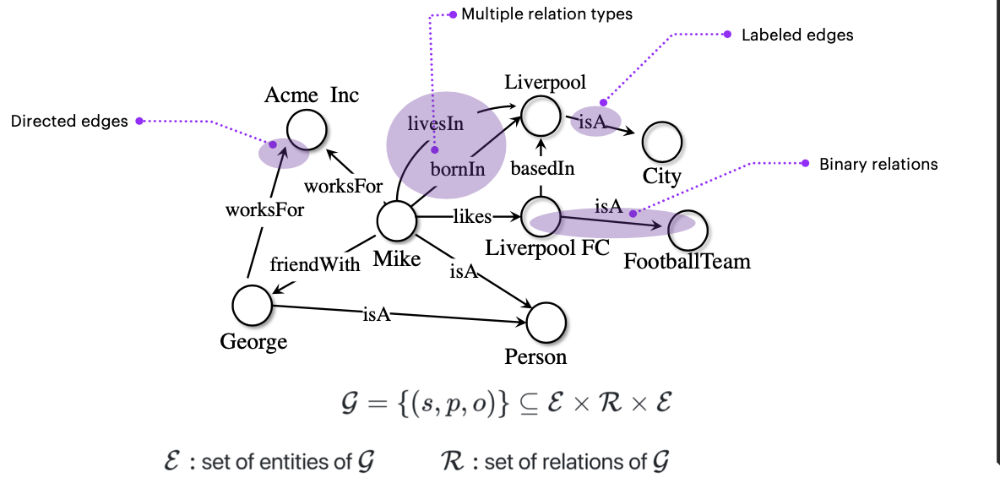

Overview of Knowledge Graphs [In-depth overview of Knowledge Graphs, Hogan et al. 2020]
:::

Some online available KG are
- yago
- WIKIDATA
- DBpedia: machine-readable version of Wikipedia
- GDELT: mined from web pages

:::{figure} kge-data-sets
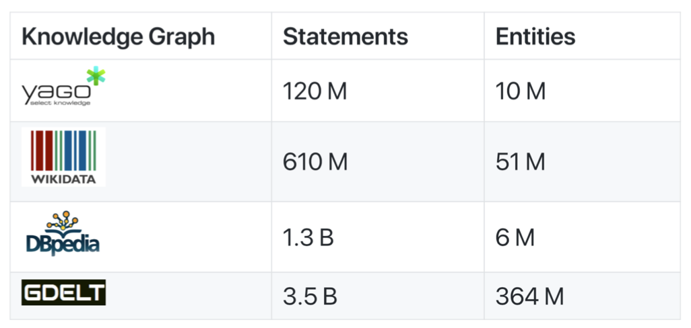

KG datasets
:::

:::{figure} kge-benchmarks
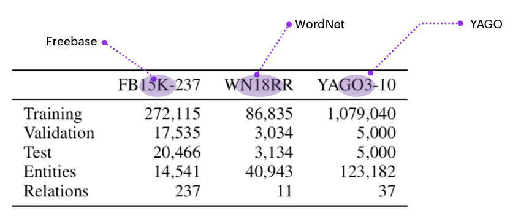

KG benchmark datasets
:::

### Assumption

Not all entities are adjacent by a relation.

- **Closed World Assumption** (CWA): absence of a fact means it is necessarily false.

- **Open World Assumption** (OWA): absence of a fact does not imply fact is false. We simply do not know. KG adopt this assumption.

### Tasks

Tasks in Machine Learning on Knowledge Graphs/ Statistical Relational Learning:

- Link Prediction / Triple Classification
  Assign a score to a missing statement $(s,p,o)$. Higher score, more likely to be true.
  - Knowledge graph completion
  - Content recommendation
  - Question answering

    :::{figure} kge-link-prediction
    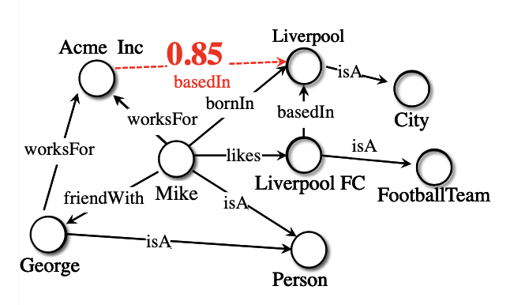

    Link Prediction
    :::

- Collective Node Classification / Link-based Clustering
  - Customer segmentation

- Entity Matching
  - Duplicate detection (entities with alias names)
  - Inventory items deduplication

In the discussion below we focus on link prediction.

### Better than Traditional Statistical Relational Learning

- **Logic Programming**: predict new links from facts and extracted rules.
- **Inductive Logic Programming (ILP)**: predict new links from rules extracted from correlated facts.
- **Rule Mining**: e.g. AMIE+: extracts Horn clauses based on their support in the KG. [Gallaraga et al. 2015]

Models
- Conditional Random Fields
- Probabilistic Relational Models
- Relational Markov networks
- Relational Dependency Networks

Limitations

- Limited Scalability to KG size
- Limited modeling power
- Non-differentiable approaches (not adapted to GPU-based learning, e.g. SGD)

### A Kind of Graph Representation Learning

Instead of hand-design features from data, GRL learn features of nodes and edges from data. [Hamilton & Sun 2019, Hamilton 2020]

CNNs are designed for grids, RNNs/word2vec for sequences. But graphs are more complex:
- No spatial locality
- No fixed-node ordering (graph isomorphism problem)
- Multimodal (concepts, text, numbers, timestamps)

Some GRL methods:

- Node Representation/Graph Feature based Methods: PRA, LINE, DeepWalk, node2vec

- Graph Neural Networks (GNNs): GCNs, Graph Attention Networks

- KGE: KGE is a kind of GRL, whose inputs are KG. TransE, DistMult, ComplEx, ConvE.

:::{figure} kge-grl
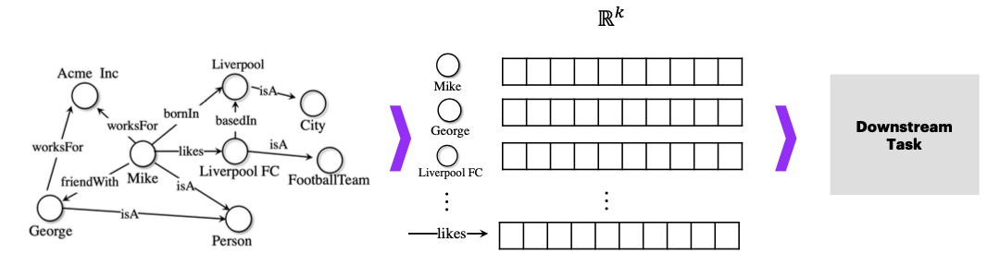

KGE as a graph representation learning method
:::

KGE aims to project nodes and edges to semantically meaningful vector representations.

:::{figure} kge-embeddings
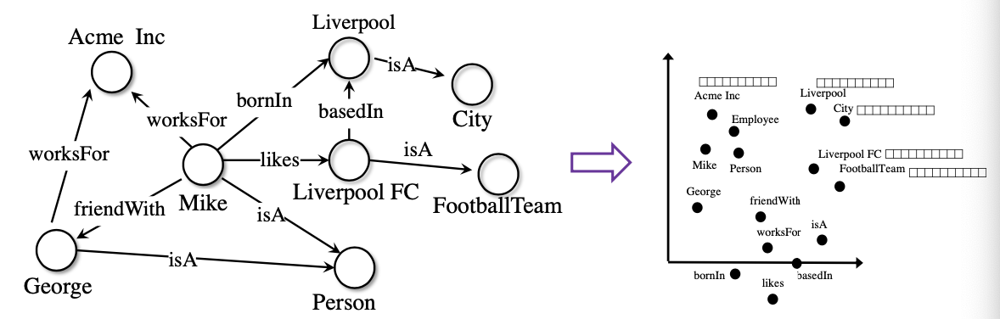

KG Embeddings
:::

### Models

:::{figure} kge-timeline

Timeline of KGE Models
:::

Wo hope the model can capture KG patterns,
- Symmetry $\texttt{<Alice marriedTO Bob>}$
- Asymmetry $\texttt{<Alice childOf Jack>}$
- Inversion $\texttt{<Alice childOf Jack>, <Jack fatherOf Alice>}$
- Composition $\texttt{<Alice childOf Jack>, <Jack siblingOf Mary>, <Alice nieceOf Mary>}$
- Hierarchies
- Type constraints
- Transitivity
- Homophily (similar concepts sit together)
- Long-range dependencies

:::{figure} kge-model-comparison

KGE model comparison
:::

## Training

:::{figure} kge-structure
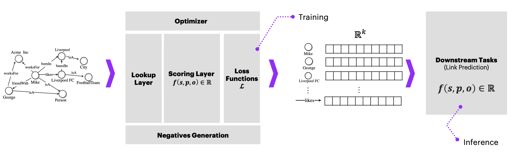

Structure of KGE
:::

Components of a model
- Input: KG $\mathcal{G}$
- Lookup layer: look the assigned embeddings of that node/relation
- Scoring function for a triple $f(s,p,o)\in \mathbb{R}$
- Loss function $\mathcal{L}$
- Optimization algorithm
- Negatives generation strategy

### Scoring Function

Scoring function $f$ assigns a score to a triple $(s,p,o)$. High score = high changes for the triple to be a true fact.

- Translation-based scoring functions

  - TransE (Translating Embeddings [Bordes et al. 2013]): the embedding of subject + embedding of property should be close to object.

    $$f_{\text {TransE}}=-\left\|\left(\mathbf{e}_{s}+\mathbf{r}_{p}\right)-\mathbf{e}_{o}\right\|_{n}$$

    :::{figure} kge-TransE-pic
    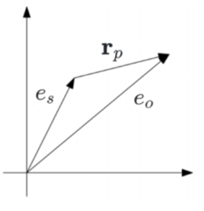

    TransE illustration
    :::

  - RotatE [Sun et al. 2019]: instead of translation, relations are modeled as rotations in complex space $\mathcal{C}$: element-wise product between complex embeddings.

    $$f_{\text {Rotat } E}=-\| \boldsymbol{e} _{s} \circ\boldsymbol{r} _{p}-\boldsymbol{e} _{o} \|_{n}$$

    :::{figure} kge-RotatE-pic
    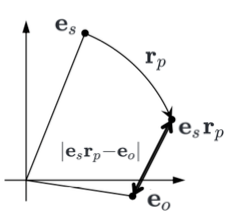

    RotatE illustration
    :::

- Factorization-based Scoring Functions

  - RESCAL [Nickel et al. 2011]: low-rank factorization with tensor product

    $$f_{RESCAL} = \boldsymbol{e} ^\top _s \boldsymbol{W} _r \boldsymbol{e} _0$$

    :::{figure} kge-RESCAL-pic
    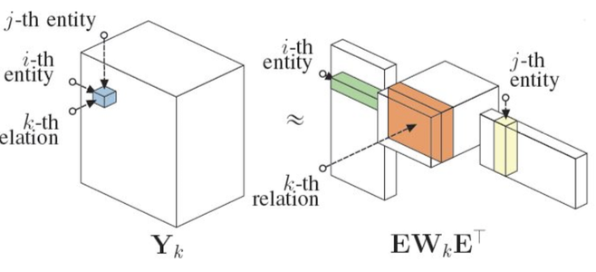

    RESCAL illustration
    :::

  - DistMult [Yang et al. 2015]: bilinear diagonal model. Dot product.

    $$f_{\text {DistMult }}=\left\langle\mathbf{r}_{p}, \mathbf{e}_{s}, \mathbf{e}_{o}\right\rangle$$

    Problem: symmetric, cannot capture asymmetric relations.

  - ComplEx [Trouilon et al. 2016] Complex Embeddings (Hermitian dot product): (i.e. extends DistMult with dot product in $\mathcal{C}$ to capture asymmetry)

    $$f_{C o m p l E x}=\operatorname{Re}\left(\left\langle\mathbf{r}_{p}, \mathbf{e}_{s}, \overline{\mathbf{e}_{o}}\right\rangle\right)$$

- Deeper Scoring Functions (complex structure, computationally expensive to train)

  - ConvE [Dettmers et al. 2017]: reshaping + convolution

    $$f_{ConvE} = \left\langle \sigma (vec(g([\bar{\boldsymbol{e}_s;\bar{\boldsymbol{r}_p } }] * \Omega)) \boldsymbol{W}) \boldsymbol{e}_o \right\rangle$$

    where $vec$ stands for 2D reshaping, $*$ stands for linear convolution, and $g$ is a non-linear function

  - ConvKB: convolutions and dot product

    $$\left.f_{C o n v K B}=\operatorname{concat}\left(g\left(\left[\mathbf{e}_{s}, \mathbf{r}_{p}, \mathbf{e}_{o}\right]\right) * \Omega\right)\right) \cdot W$$

- Other recent scoring functions
  - HolE [Nickel et al. 2016]
  - SimplE [Kazemi et al. 2018]
  - QuatE [Zhang et al. 2018]
  - MurP [Balazevic et al. 2018]

### Loss Function

Design rationale: encourages high score for true triples and low score for synthetic negatives

- Pairwise Margin-Based Hinge Loss [Bordes et al. 2013]
  - Pays a penalty if score of positive triple $<$ score of synthetic negative by a margin $\gamma$.

    $$\mathcal{L}(\Theta)=\sum_{t^+ \in \mathcal{G}} \sum _{t^- \in \mathcal{C}} \max \left(0,\left[\gamma+f\left(t^{-} ; \Theta\right)-f\left(t^{+} ; \Theta\right)\right]\right)$$

    where
    - $t^+ \in \mathcal{G}$ are true triples
    - $t^- \in \mathcal{C}$ are synthetic negatives

  - Encourages high score for $t^+$ and low score for $t^-$

- Negative Log-Likelihood / Cross Entropy [Trouilon et al. 2016]

    $$\mathcal{L}(\Theta)=\sum_{t \in \mathcal{G} \cup \mathcal{C}} \log (1+\exp (-y f(t ; \Theta)))$$

    where $y$ is the label of the triple $y \in \left\{ -1 ,1 \right\}$.

- Binary Cross-Entropy [Dettmers et al. 2017]

  $$\mathcal{L}=-\frac{1}{N} \sum_{t \in \mathcal{G} \cup \mathcal{C}}^{N} y \cdot \log (\sigma(f(t ; \Theta)))+(1-y) \cdot \log (1-f(t ; \Theta))$$

- Self-Adversarial [Sun et al. 2019]

  $$\mathcal{L}=-\log \sigma\left(\gamma+f\left(t^{+} ; \Theta\right)\right)-\sum_{t c \mathcal{C}}^{N} p\left(t^{-} ; \Theta\right) \log \sigma\left(-f\left(t^{-} ; \Theta\right)-\gamma\right)$$

  where $p(t^-;\Theta)$ is the weight for the negative sample $t^-$.

- Others: Multiclass Negative Log-likelihood, Absolute Margin, etc

### Trainability

Regularization
- L1, L2
- L3 [Lacroix et al. 2018]
- Dropout (ConvE) [Dettmers et al. 2017]

Initialization of embeddings
- Random (Uniform)
- Random (Normal)
- Glorot

### Negative Generation

How to generate negative examples (false facts)?

Local Closed World Assumption: the KG is only locally complete

We can corrupt subject or object, and retain the predicate, to generate negative examples. In other words, we replace the subject (or object) in a triple by another subject (or object) in the entities.

$$
\mathcal{C}=\left\{\left(\hat{s}, p,o o\right) \mid \hat{s} \in \mathcal{E}\right\} \cup\{(s, p, \hat{o}) \mid \hat{o} \in \mathcal{E}\}
$$

addimg32

In training, for each positive triple $t$, there are various sampling methods

- uniform sampling: sample $n$ from all synthetic negatives
- complete set: use all synthetic negatives (mind scalability)
- 1-n scoring [Dettmers et al. 2017]: batches of $(s,p, *)$ or $(*, p, o)$ labeled as positives (if included in training set KG) or negatives (if not in training set KG).

### Optimizer

SGD to train model to learn embeddings.

### Data Augmentation??

Reciprocal Triples: Injection of reciprocal triples in training set.

$$
\texttt{<Alice childOf Jack>} \Rightarrow \texttt{<Alice childOf} ^{-1}  \texttt{ Alice>}
$$

## Model Selection

### Hyperparameters Tuning

- Grid search
  - Mind the size of the grid!
  - Early stopping
- Random search
- Quasi-random + Bayesian [Ruffinelli et al. 2020]

### Evaluation

For link prediction, the evaluation methods are based on the question: How well are unseen positive triples ranked (by probability) against synthetic negatives generated under the Local Closed World Assumption? We want the rank to be smaller.

- Mean Rank (MR)

  $$
  M R=\frac{1}{|Q|} \sum_{i=1}^{|Q|} \operatorname{rank}_{(s, p, o)}
  $$

  Smaller, better.

- Mean Reciprocal Rank (MRR)

  $$
  M R R=\frac{1}{|Q|} \sum_{i=1}^{|Q|} \frac{1}{\operatorname{rank}_{(s, p, o)_{i}}}
  $$

  which avoids outlier effect in MR. Larger, better.

- Hist@N

  $$
  \text { Hits } @ N=\sum_{i=1}^{|Q|} \mathbb{I}\left( \operatorname{rank}_{(s, p, o)_{i}} \leq N \right)
  $$

  Smaller, better.

addimg39

Mind tie ranks [Ruffinelli et al. 2020]

## Advanced Topics

### Calibration of Probabilities

Probabilities Generated by KGE models are Uncalibrated. They do NOT have the meaning described by #success/#trials.

Poor Interpretability in high-stakes scenarios (i.e. drug-target discovery)

### Multimodal Knowledge Graphs

Many real-world graphs includes multi-modal objects.

OOP points of view: image, numbers, date, text.

:::{figure} kge-multimodal-kg
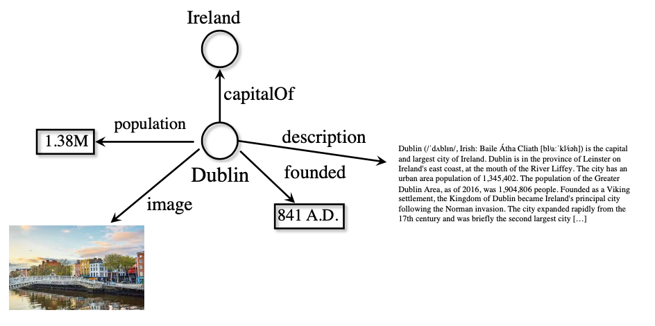

Multi-modal KGs
:::

Sol: CNN for image, RNN for text, ANN for numbers, ... concatenate them to $\boldsymbol{e} _o$.

### Temporal Knowledge Graphs

Timestamped relations.

### Uncertain Knowledge Graphs

Relation with confidence.

### Robustness

Perturbation of true positives.

### Neuro-Symbolic Reasoning

.
