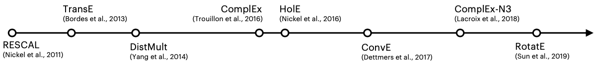

# KGE

TransE, DistMult, ComplEx, ConvE

:::{figure} kge

caption
:::

Objective:
Find meaningful low-dim embeddings such that
- semantical meaningful
- good for predicting KG patterns (reasoning of link relations)

  :::{figure} kge-patterns
  

  caption
  :::

- and also
  - hierarchies
  - type constraints
  - transitivity
  - homophily

:::{figure} kge-model-comparison

KGE model comparison
:::
