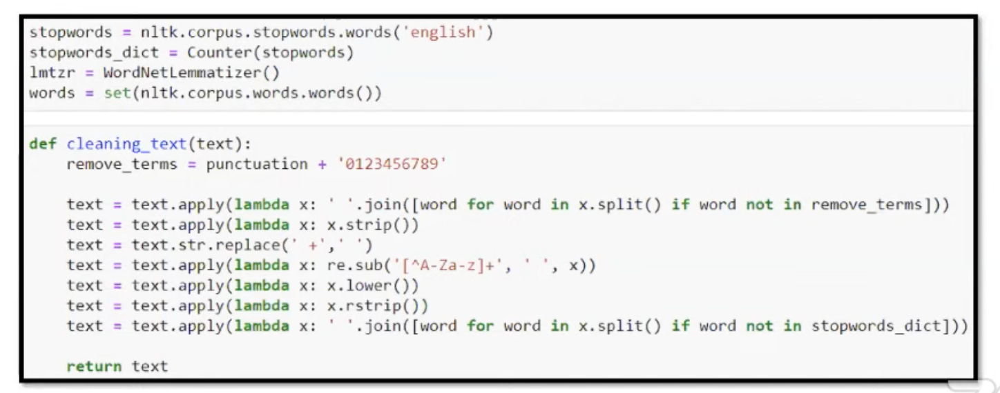

# NLP

Objectives:
- sentiment analysis
- machine translation
- speech tags (verb, noun, etc.)
- human-machine communication (chatbots)

Language Modeling
- predict the next word/character
- image captioning
- text summarization
- spelling correction

monkeylearn.com/text-classification

## Text Processing with Python

- convert to upper and lower case: `str.upper(), str.lower()`
- remove whitespace in the start and end: `str.strip()`
  - only in the start: `str.lstrip()`
  - only in the end: `str.rstrip()`
- return a list of substrings separated by the given delimiter: `str.split(delimiter)`
- replace: `str.replace(old, new)`

## Text Pre-Processing

- remove
  - stop words
  - punctuations
  - symbols, spaces
  - numbers
- convert
  - all words to lower case
  - lemmatization (to root words)

:::{figure} nlp-pre-processing

Pre-processing
:::

Then check words frequency, to see if there are words of no meaning, which can be added to stop words

## Training

CountVectorizer in `sklearn.feature_extraction.text` gives a matrix.
